<p align="left">
Universidad San Carlos de Guatemala<br>
Facultad de Ingeniería<br>
Ingeniería en ciencias y sistemas<br>
Laboratorio de Software Avanzado 

Nombre: Sergio Joel Rodas Valdez<br>
Carné: 202200271
</p>

# Práctica 3: arquitectura de microservicios para procesamiento de transacciones bancarias
---

## Índice

1. [El problema](#1-el-problema)
2. [La arquitectura de un vistazo](#2-la-arquitectura-de-un-vistazo)
3. [Dónde se resuelve cada requerimiento](#3-dónde-se-resuelve-cada-requerimiento)
4. [Por qué estos cinco microservicios](#4-por-qué-estos-cinco-microservicios)
5. [Integración con la Práctica 2: identidad federada](#5-integración-con-la-práctica-2-identidad-federada)
6. [El flujo de aprobación de tres pasos](#6-el-flujo-de-aprobación-de-tres-pasos)
7. [Comunicación entre servicios](#7-comunicación-entre-servicios)
8. [Propuesta de API Gateway](#8-propuesta-de-api-gateway)
9. [El adaptador del core y la idempotencia](#9-el-adaptador-del-core-y-la-idempotencia)
10. [Notificación a los beneficiarios](#10-notificación-a-los-beneficiarios)
11. [Logging centralizado y auditoría](#11-logging-centralizado-y-auditoría)
12. [Estrategia de almacenamiento de los CSV](#12-estrategia-de-almacenamiento-de-los-csv)
13. [Modelo de datos: un ER por microservicio](#13-modelo-de-datos-un-er-por-microservicio)
14. [Diagramas de clases](#14-diagramas-de-clases)
15. [Diagrama de componentes](#15-diagrama-de-componentes)
16. [Diagramas de secuencia](#16-diagramas-de-secuencia)
17. [Los cinco principios SOLID en este diseño](#17-los-cinco-principios-solid-en-este-diseño)
18. [Tecnologías propuestas y por qué](#18-tecnologías-propuestas-y-por-qué)
19. [Supuestos declarados](#19-supuestos-declarados)

---

## 1. El problema

La institución bancaria procesa sus transacciones en un sistema monolítico que se arrastra en los picos: fin de mes, planillas masivas, temporada de impuestos. Cuando todo vive en un solo proceso, el pico de un módulo castiga a los demás, y escalar significa clonar el sistema entero aunque la presión venga de un solo punto.

El rediseño tiene que cubrir siete cosas:

- Autenticación con el OAuth corporativo (token de 12 horas), integrada con el módulo de la Práctica 2.
- Integración con el core bancario y la compensación interbancaria.
- Carga de transacciones por CSV (transferencias masivas y pagos en lote), validadas contra reglas de negocio y guardadas en la nube.
- Un flujo de aprobación de tres pasos.
- Correo a los beneficiarios cuando el lote queda aprobado.
- Historial de lotes consultable, con descarga del archivo.
- Logging centralizado y auditable.

Un dato que conviene tener presente desde el inicio: un lote de planilla trae doscientas mil filas. Ese número condiciona casi todo lo que sigue, desde por qué la validación corre en segundo plano hasta por qué la firma es sobre el lote y no sobre cada transacción.

---

## 2. La arquitectura de un vistazo

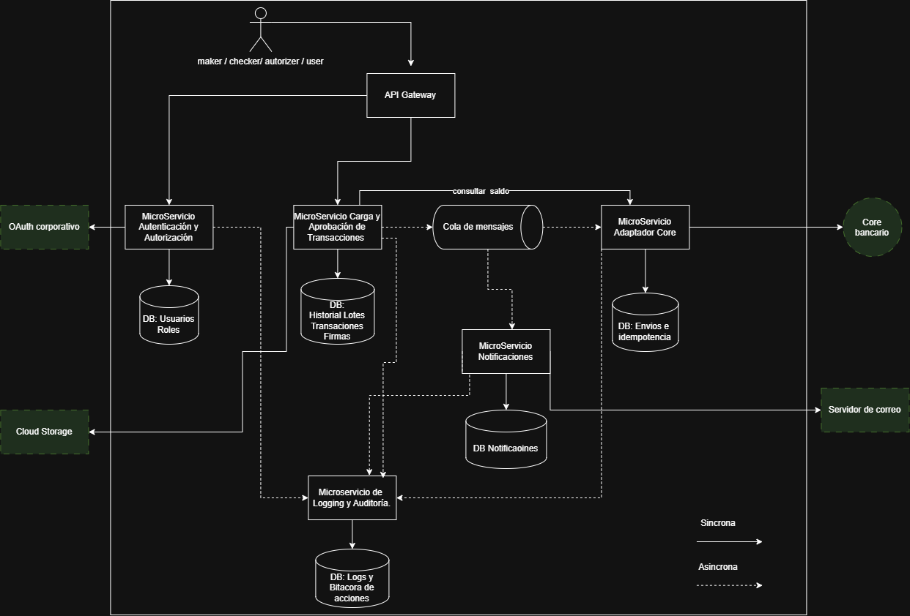

Cinco microservicios, cada uno con su propia base de datos, más dos piezas de infraestructura: el API Gateway como única puerta de entrada y una cola de mensajes para lo que no necesita respuesta inmediata.

| Microservicio | De qué es dueño | Base de datos |
|---|---|---|
| Autenticación y Autorización | Identidad y roles. Reutiliza el módulo de la Práctica 2 | `auth_db` |
| Carga y Aprobación de Transacciones | El ciclo de vida completo del lote | `carga_aprobacion_db` |
| Adaptador del Core | Único interlocutor con el core bancario | `adaptador_core_db` |
| Notificaciones | Correos a los beneficiarios | `notificaciones_db` |
| Logging y Auditoría | Log técnico y bitácora de auditoría | `logging_db` |

Los sistemas externos (OAuth corporativo, core bancario y compensación interbancaria, Cloud Storage y el servidor de correo) aparecen con borde punteado en el diagrama. No se diseñan, solo se integran.

Maker, checker y authorizer son personas, no cajas del diagrama. Sus roles salen del módulo de autorización de la Práctica 2.

---

## 3. Dónde se resuelve cada requerimiento

| Lo que pide el enunciado de esta práctica | Dónde está en este documento |
|---|---|
| Diagrama de arquitectura general | [Sección 2](#2-la-arquitectura-de-un-vistazo) |
| Integración del servicio de autenticación de la P2 | [Sección 5](#5-integración-con-la-práctica-2-identidad-federada) |
| Diseño de microservicios con separación de responsabilidades | [Sección 4](#4-por-qué-estos-cinco-microservicios) |
| Flujo de aprobación de 3 pasos | [Sección 6](#6-el-flujo-de-aprobación-de-tres-pasos) y [secuencia 1](#161-aprobación-de-transacciones-en-tres-pasos) |
| Correo a beneficiarios al aprobar el lote | [Sección 10](#10-notificación-a-los-beneficiarios) y [secuencia 3](#163-notificación-a-los-beneficiarios) |
| Historial consultable con descarga | [Sección 12](#descarga-desde-el-historial) |
| Logging centralizado y auditable | [Sección 11](#11-logging-centralizado-y-auditoría) |
| Estrategia de almacenamiento de los CSV | [Sección 12](#12-estrategia-de-almacenamiento-de-los-csv) |
| Comunicación entre servicios | [Sección 7](#7-comunicación-entre-servicios) |
| Propuesta de API Gateway | [Sección 8](#8-propuesta-de-api-gateway) |
| ER por microservicio | [Sección 13](#13-modelo-de-datos-un-er-por-microservicio) |
| Clases UML por microservicio | [Sección 14](#14-diagramas-de-clases) |
| Secuencia UML de los flujos críticos | [Sección 16](#16-diagramas-de-secuencia) |
| Componentes UML | [Sección 15](#15-diagrama-de-componentes) |
| Principios SOLID aplicados | [Sección 17](#17-los-cinco-principios-solid-en-este-diseño) |

---

## 4. Por qué estos cinco microservicios

El criterio de corte no fue el sustantivo sino la razón de cambio. Dos funcionalidades van juntas cuando cambian por el mismo motivo y se separan cuando cambian por motivos distintos, tienen dueños distintos o escalan distinto.

### 4.1 Qué hace cada uno

Autenticación y Autorización sabe quién es el usuario y qué rol tiene. Habla con el OAuth corporativo, emite la sesión propia y guarda el catálogo de roles. Nada más.

Carga y Aprobación de Transacciones recibe el CSV, lo valida, guarda las transacciones, registra las tres firmas y publica el evento cuando el lote queda aprobado. Es el servicio más pesado del sistema.

El Adaptador del Core es el único que sabe hablar el idioma del core bancario. Traduce, envía, reintenta y guarda el resultado transacción por transacción.

Notificaciones rinde plantillas y manda correos. Le da igual de dónde venga el evento que las dispara.

Logging y Auditoría recibe los eventos técnicos y los de auditoría de todos los demás. Es el único servicio que todos conocen y ninguno espera.

### 4.2 Por qué carga y aprobación no se partieron en dos

Fue la decisión que más discutí conmigo mismo. El lote es un solo agregado: su ciclo de vida (cargado, validado, firmado 1-2-3, enviado) es una única máquina de estados. Partirlo habría dejado el estado del lote repartido entre dos dueños, y cada transición habría necesitado coordinación distribuida para algo que en una sola base es un `UPDATE`.

El costo lo asumo y lo digo claro: se pierde escalabilidad independiente. Validar doscientas mil filas y registrar tres firmas son cargas incomparables, y ahora escalan juntas. Si el sistema creciera, esa es la primera costura por donde lo cortaría.

Lo que no es cierto es que los uniera por comodidad. Carga es la parte más cara del sistema, no la más sencilla.

### 4.3 Por qué no hay un microservicio por tipo de transacción

Un servicio de depósitos, otro de transferencias, otro de retiros. Suena ordenado y es un error: los tres comparten ciclo de vida, reglas, actores y estado. Cortar así es cortar por sustantivo. El síntoma aparece rápido, porque agregar un tipo nuevo obligaría a crear un servicio nuevo y a repetir en él la máquina de estados completa.

Sobre el alcance: el enunciado habla de transferencias masivas, pagos en lote y depósitos en lote. Retiros no menciona, así que no están en el diseño.

### 4.4 Qué viaja entre la carga y la aprobación

Entre la fase de carga y la de aprobación viaja el aviso de que el lote está listo, no las transacciones. Carga y Aprobación es dueña de las transacciones y del estado individual de cada una; la firma solo guarda lote, paso, usuario, rol, decisión y fecha.

De ahí sale la propiedad que más me gusta del diseño: la firma es sobre el lote, no sobre cada transacción. Tres firmas, no seiscientas mil. Y el checker igual puede excluir filas puntuales, porque el estado de cada fila vive en la entidad `Transaccion`.

---

## 5. Integración con la Práctica 2: identidad federada

El enunciado pide OAuth corporativo y también pide reutilizar el módulo de autenticación de la Práctica 2. No compiten: responden preguntas distintas.

| | OAuth corporativo | Módulo de la Práctica 2 |
|---|---|---|
| Qué responde | ¿Quién eres? | ¿Qué rol tienes en este sistema? |
| Quién lo administra | TI del banco, para toda la institución | Este sistema |
| Dónde vive | Sistema externo | Microservicio propio |

El usuario se autentica contra el OAuth corporativo y recibe el token de 12 horas. El servicio de autenticación valida ese token, busca al usuario en su propia base, resuelve sus roles y emite la sesión propia: el JWT en cookie HTTP-only con los datos sensibles cifrados en AES que diseñé en la Práctica 2. El token corporativo aporta la identidad inicial y ahí termina su trabajo.

Eso es identidad federada: el banco es la autoridad sobre quién eres, este sistema es la autoridad sobre qué puedes hacer aquí. Si mañana el banco cambia de proveedor de OAuth, los roles de maker, checker y authorizer no se mueven.

La validación de la sesión y la resolución de roles se centralizan en el API Gateway. Los microservicios reciben la identidad ya verificada y no vuelven a consultar al servicio de autenticación en cada petición, que sería convertirlo en cuello de botella de todo el sistema.

Una consecuencia que prefiero declarar antes de que me la pregunten: la sesión es stateless, no hay tabla `sesion`. Un token emitido no se puede revocar antes de que expire. Lo mitigo con vigencia corta de la sesión propia, y el costo queda asumido a cambio de no consultar la base en cada petición.

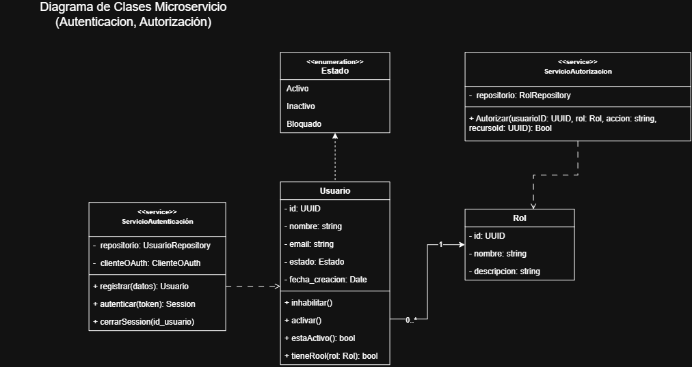

---

## 6. El flujo de aprobación de tres pasos

### 6.1 Qué problema resuelve

El flujo de tres pasos es un control antifraude. Su principio de fondo es que ninguna persona sola puede mover dinero del banco, y de ahí sale todo lo demás: los tres roles, el orden de las firmas y la validación que impide que alguien firme dos veces.

| Paso | Actor | Qué hace |
|---|---|---|
| 1 | Maker | Declara que el lote está listo para revisión |
| 2 | Checker | Revisa el resultado ya validado por el sistema y confirma |
| 3 | Authorizer | Autoriza el movimiento de dinero |

El paso 1 no es subir el archivo. El maker puede subir, corregir y volver a subir el CSV las veces que quiera; eso es preparación y no deja firma. El paso 1 ocurre cuando declara que ya está listo, y a partir de ahí el lote entra en aprobación.

### 6.2 El sistema valida, la persona aprueba

Ningún humano revisa doscientas mil filas. Cuando el checker abre el lote se encuentra el trabajo hecho y un resumen del estilo "1,950 válidas, 50 sin fondos", con el detalle de cada rechazo. Su decisión es sobre ese resumen.

Un control que exigiera doscientos mil clics no se ejecutaría nunca. En la práctica alguien terminaría dándole a "aprobar todo" sin mirar, y el control quedaría en el papel.

### 6.3 Segregación de funciones

`validarSeparacionFunciones()` corre en cada uno de los tres pasos e impide que la misma persona firme dos pasos del mismo lote aunque tenga los tres roles. Sin eso, alguien con permisos amplios podría cargar un lote a su favor y firmarlo tres veces.

La regla no se queda en el código. En la base la respalda `uq_firma_paso (lote_id, paso)`, que hace imposible registrar dos firmas para el mismo paso del mismo lote. En la industria esto se llama segregación de funciones, y es un requisito de auditoría en cualquier sistema que mueva dinero.

### 6.4 Dónde se valida el saldo

En la fase de carga, antes de que entre el primer humano. Si el saldo se validara en el paso del checker, dos personas habrían gastado su tiempo revisando un lote sin fondos y el maker se enteraría días después.

Tres detalles que definen esta validación:

Es un filtro, no una garantía. La autoridad final sobre el saldo es el core en el momento del posting, y entre la validación y el envío pueden pasar días. El filtro existe para dar retroalimentación temprana y para no mandarle basura al core.

Se consulta una vez por cuenta distinta, no por fila. Una planilla debita la misma cuenta empresarial miles de veces; consultar el saldo por cada fila es el problema N+1 de manual, y con doscientas mil filas se traduce en doscientas mil llamadas al core para conocer un puñado de saldos.

El monto se acumula por cuenta dentro del lote. Una cuenta con Q100,000 y tres transferencias de Q40,000 pasaría las tres si cada una se verificara por separado. Por eso el monto ya comprometido se descuenta conforme se recorre el archivo.

La consulta del saldo sale por el Adaptador del Core, nunca directo al core. El core tiene un solo interlocutor en todo el sistema.

### 6.5 La carga es asíncrona

El sistema acepta el archivo, responde `202 Accepted` con un `loteId` y valida en segundo plano. Un lote grande tarda minutos en validarse y ninguna sesión HTTP sobrevive esa espera. El maker consulta después el resultado con el `loteId`, o lo ve en el historial.

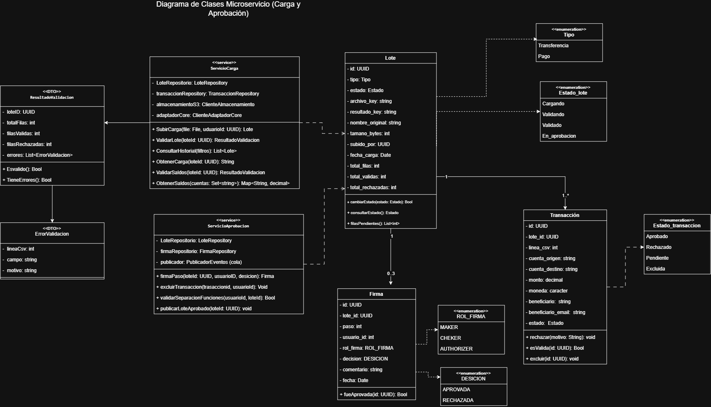

---

## 7. Comunicación entre servicios

### 7.1 La regla

Síncrono cuando el llamador no puede seguir sin la respuesta. Asíncrono cuando el trabajo puede completarse después.

| Origen y destino | Tipo | Por qué |
|---|---|---|
| Gateway a Autenticación | REST | Necesita saber si el token vale antes de dejar pasar la petición |
| Gateway a Carga y Aprobación | REST | Es una petición de usuario y espera respuesta |
| Carga a Adaptador del Core | REST | Sin el saldo no puede validar |
| Carga a Cloud Storage | REST | Necesita confirmar que el archivo quedó guardado |
| Autenticación a OAuth corporativo | REST | Sin la identidad no puede emitir la sesión |
| Adaptador a Core Bancario | REST | Necesita el resultado transacción por transacción |
| Notificaciones a Servidor de Correo | SMTP | Necesita saber si el correo salió |
| Carga a la cola | Asíncrono | Publica `LoteAprobado` y termina |
| Cola a Adaptador del Core | Asíncrono | Consume el evento cuando puede |
| Cola a Notificaciones | Asíncrono | Consume el mismo evento |
| Todos a Logging | Asíncrono | Nunca debe ser punto único de falla |

### 7.2 Un evento, dos consumidores

Cuando el authorizer firma el paso 3, Carga y Aprobación publica un evento y se olvida. Dos componentes lo consumen por su cuenta: el Adaptador del Core, que envía el lote, y Notificaciones, que avisa a los beneficiarios. Ninguno de los dos sabe que el otro existe, y Carga y Aprobación no espera respuesta de ninguno.

Lo que se gana con eso es concreto:

Si el core está en ventana de mantenimiento a las once de la noche, el authorizer aprueba igual. El mensaje espera en la cola y sale cuando el core vuelve. Nadie repite el proceso de aprobación al día siguiente.

Si el servidor de correo se cae, el lote se envía al core de todas formas. Un problema de comunicación con el cliente no detiene el dinero.

Si mañana se quiere agregar un consumidor de reportería, se suscribe a la cola y ya. No se modifica ni una línea de Carga y Aprobación. Eso es el principio abierto/cerrado a nivel de arquitectura.

Con llamadas REST directas, en cambio, el authorizer se quedaría esperando a que se enviaran miles de correos antes de recibir su respuesta HTTP.

---

## 8. Propuesta de API Gateway

### 8.1 Qué resuelve

El gateway es la única puerta de entrada al sistema. Sin él, cada cliente tendría que conocer la dirección de cada microservicio, y cada microservicio tendría que repetir la validación del token, el CORS, el rate limiting y la generación del identificador de petición. Ese patrón tiene nombre propio, API Gateway pattern, y aquí carga cuatro responsabilidades:

La primera es el enrutamiento. El gateway traduce la ruta pública al servicio que corresponde:

| Ruta pública | Servicio destino |
|---|---|
| `/auth/*` | Autenticación y Autorización |
| `/lotes/*`, `/transacciones/*`, `/firmas/*` | Carga y Aprobación |
| `/notificaciones/*` (solo consulta) | Notificaciones |
| `/auditoria/*` (solo rol auditor) | Logging y Auditoría |

La segunda es validar la sesión y resolver los roles en la frontera. El gateway verifica la firma del JWT, revisa la vigencia y descifra los datos de la cookie. Si la sesión no vale, la petición muere ahí y nunca toca un microservicio. Si vale, inyecta la identidad y los roles en cabeceras internas, y los servicios de atrás confían en ellas porque la red interna no es alcanzable desde afuera.

La tercera es generar y propagar el `id_peticion`. El gateway crea un identificador único por petición y lo pasa hacia adentro. Cada servicio lo arrastra en sus logs y lo mete dentro del mensaje que publica en la cola, así que una petición se sigue por los cinco servicios con un solo valor de búsqueda. Es el correlation ID clásico.

La cuarta es todo lo transversal: TLS, CORS, límite de tamaño del cuerpo (que aquí importa, porque entran archivos CSV) y rate limiting por usuario, para que un cliente automatizado no sature la carga en fin de mes.

### 8.2 Qué no pasa por el gateway

El Adaptador del Core no está publicado. No tiene ruta, ningún usuario lo invoca y el gateway no lo apunta. Su única entrada síncrona es `IConsultaSaldo`, que solo usa Carga y Aprobación por la red interna, y el envío al core siempre le llega por la cola.

La cola y el servicio de logging tampoco se exponen. La única lectura pública de la bitácora es la consulta de auditoría, que pasa por el gateway y exige rol de auditor.

### 8.3 Qué tecnología propongo

Kong Gateway, sobre NGINX.

La razón principal es que tres de las cuatro responsabilidades de arriba ya vienen resueltas como plugins de configuración declarativa: validación de JWT, correlation ID y rate limiting. Escribirlas a mano en este proyecto sería reimplementar algo que ya está probado en producción en muchos bancos, y cada línea propia en la frontera de seguridad es una línea que hay que auditar.

Las alternativas que consideré:

NGINX puro sería el más liviano, pero deja la validación del token, el identificador de petición y las métricas como código a la medida. Barato de instalar, caro de mantener.

Spring Cloud Gateway es una opción sólida, aunque el módulo de autenticación de la Práctica 2 está escrito en NestJS y meter un runtime de Java solo para la puerta de entrada agrega una plataforma más que operar.

Un gateway administrado de nube (por ejemplo AWS API Gateway) quita trabajo de operación, a cambio de amarrar el enrutamiento al proveedor y de complicar el entorno local. Para un sistema bancario que ya tiene el core en casa, prefiero la puerta en casa.

---

## 9. El adaptador del core y la idempotencia

### 9.1 Anti-corruption layer

El core bancario tiene su propio formato, sus propios códigos de error y su propio calendario de mantenimiento. Si ese formato se filtrara a los demás servicios, un cambio de proveedor obligaría a tocar medio sistema.

El adaptador implementa el patrón anti-corruption layer: traduce entre el modelo del sistema y el del core, y es el único punto donde ese formato existe. Si el banco cambia de proveedor, se reescribe este componente y los otros cuatro microservicios ni se enteran.

### 9.2 La idempotencia es lo importante de este servicio

Este es el escenario que hay que resolver: el adaptador manda el lote, el core lo procesa, y la red se cae antes de que llegue la respuesta. El adaptador queda ciego, sin saber si el dinero se movió.

Sin clave de idempotencia solo hay dos salidas y las dos son malas. Reintentar y arriesgarse a pagar la planilla dos veces. O no reintentar y arriesgarse a que la planilla nunca salga.

La clave se genera una vez por lote y viaja junto con él. Al reintentar se manda la misma clave, el core reconoce que ya la procesó y devuelve el resultado original en lugar de volver a aplicar los movimientos. El contador de `intentos` dice cuántas veces se envió; la clave garantiza que solo se aplicó una vez.

Si cada reintento generara una clave nueva, el core vería operaciones distintas y aplicaría la planilla varias veces. Por eso la clave se genera por lote y nunca por intento. En la base lo sostiene `uq_envio_idempotencia (clave_idempotencia)`: esa restricción es la idempotencia. Un mensaje duplicado en la cola choca contra el UNIQUE y se descarta.

### 9.3 El estado PARCIAL

El core responde transacción por transacción. De doscientas mil puede aceptar 199,950 y rechazar 50 por cuenta cerrada o datos inválidos. Ese envío no fue exitoso ni fallido, y sin un estado intermedio no habría forma de representarlo ni de saber qué reintentar. Por eso existe `PARCIAL` y por eso `envio_detalle` guarda el resultado de cada fila con la referencia que devolvió el core.

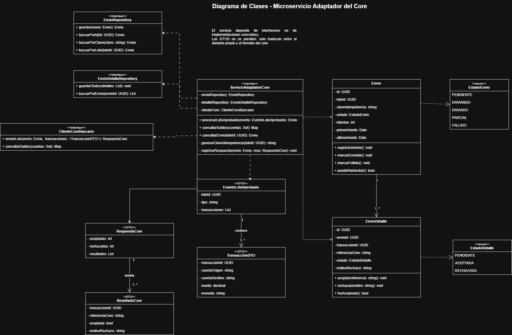

---

## 10. Notificación a los beneficiarios

Cuando el lote queda aprobado, cada beneficiario recibe un correo avisando que su transacción está en proceso. El servicio consume el evento de la cola, busca la plantilla, rinde asunto y cuerpo con los datos de cada transacción y manda el correo por SMTP.

El detalle de diseño que importa aquí es dónde vive el estado: por notificación, no por lote. Si el estado fuera del lote completo y el envío fallara en el correo 150,000, al reintentar se reenviarían los 149,999 ya entregados y cada cliente recibiría el aviso dos veces. Con estado individual, `reintentarFallidas()` toma solo las que quedaron en `FALLIDA`.

Nadie llama a este servicio. Consume de la cola, y esa decisión es la que evita que una caída del servidor de correo bloquee la aprobación de un lote.

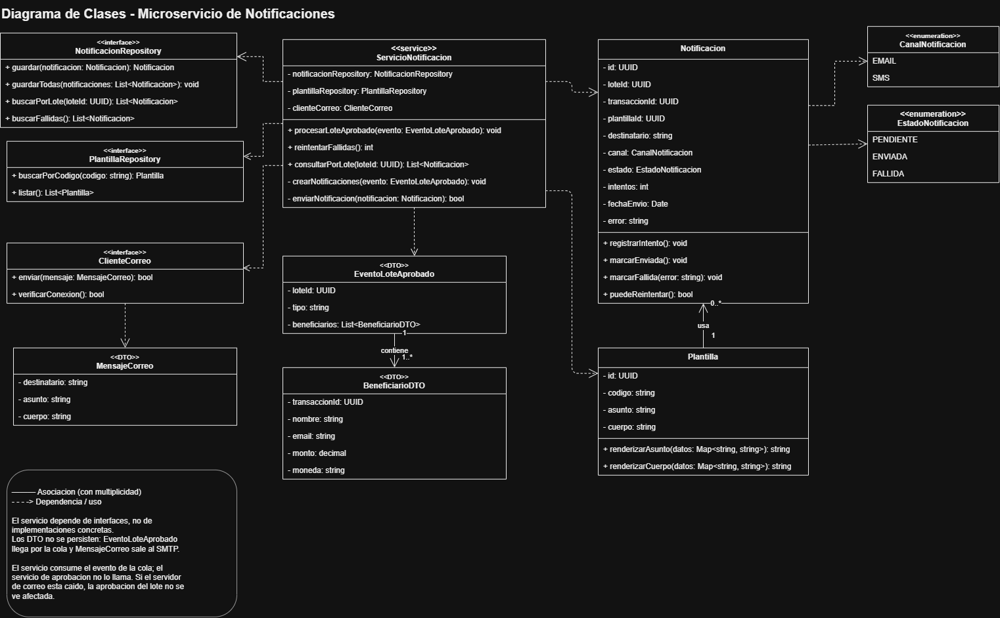

---

## 11. Logging centralizado y auditoría

### 11.1 Son dos cosas distintas

Las mezclé en el primer borrador y me arrepentí rápido. Son dos tablas sin relación entre sí porque sirven a públicos distintos:

| | Log técnico | Bitácora de auditoría |
|---|---|---|
| Para qué | Observabilidad y depuración | Evidencia legal |
| Quién lo lee | Un ingeniero | Un auditor |
| Qué guarda | Nivel, mensaje, servicio, traza | Quién hizo qué, sobre qué y cuándo |
| Cuánto vive | Se purga en pocos meses | Se conserva años |
| Se modifica | Se puede purgar | Nunca |

Un log técnico que se llena de eventos de negocio se vuelve inútil para depurar. Una bitácora de auditoría contaminada con `DEBUG` deja de servir como evidencia.

### 11.2 Una interfaz genérica, no un método por servicio

El servicio expone `registrarLog()` y `registrarAuditoria()`, y el origen viaja en el campo `servicio` del propio evento. No hay `registrarLogDeCarga()` ni `registrarLogDeNotificaciones()`. Agregar un microservicio nuevo mañana no obliga a tocar el de logging.

### 11.3 Seguir una petición por los cinco servicios

El campo `id_peticion`, el correlation ID, lo genera el API Gateway y cada servicio lo propaga, incluso dentro del mensaje que publica en la cola. Con un solo valor se reconstruye el recorrido completo de una petición: qué pasó en el gateway, qué pasó en carga, qué publicó en la cola y qué hizo el adaptador media hora después. Sin ese identificador, depurar un sistema distribuido es leer cinco archivos de log sin nada en común.

### 11.4 Que ninguna acción quede sin registro

El envío al servicio de logging es asíncrono y de tipo fire-and-forget: nadie espera confirmación, porque un servicio de logging caído no puede tumbar una aprobación bancaria.

Eso abre un hueco. Si la acción de negocio se guarda y el evento de auditoría se pierde en el camino, queda una operación sin rastro, que es justo lo que un auditor no perdona.

La solución es el patrón transactional outbox. Cada microservicio tiene una tabla `evento_pendiente`: el evento de auditoría se escribe ahí en la misma transacción que la acción de negocio, así que o se guardan las dos cosas o no se guarda ninguna. Un publicador aparte lee esa tabla y entrega los eventos al servicio de logging, reintentando hasta lograrlo.

La tabla se llama `evento_pendiente` a propósito, para no confundirla con `evento_auditoria` de `logging_db`, que es el registro permanente. La de cada servicio es un buzón temporal.

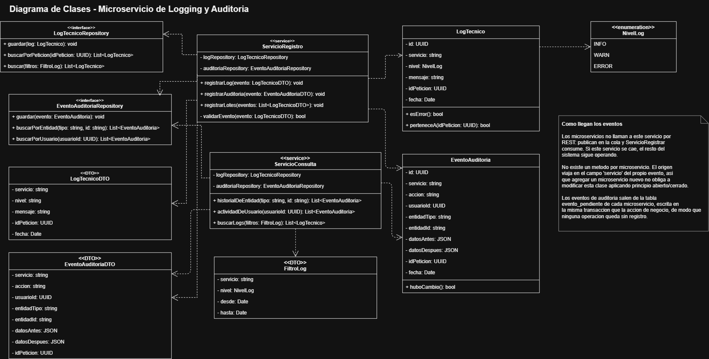

---

## 12. Estrategia de almacenamiento de los CSV

Los archivos que carga el maker no se guardan dentro de la base de datos. Van a Amazon S3, y la base conserva los metadatos del lote junto con la llave del objeto.

Una base relacional está optimizada para consultar filas, no para custodiar archivos de decenas de megabytes. Guardar los CSV dentro de ella infla los respaldos, encarece el almacenamiento y degrada las consultas que sí importan. S3 está hecho para lo contrario: objetos grandes, costo bajo y una durabilidad muy superior a la de un disco propio.

### Qué se conserva

El archivo original queda exactamente como lo subió el maker, sin una sola modificación. La razón es de auditoría antes que técnica: si dentro de un año un cliente reclama una transferencia, el banco tiene que poder mostrar qué se cargó, quién lo cargó y cuándo, no una versión ya procesada por el sistema. El `checksum` que guarda la tabla `lote` permite demostrar que el archivo es exactamente ese.

Al terminar la validación se genera un segundo archivo con el resultado: qué filas pasaron, cuáles se rechazaron y por qué. Ese es el que se ofrece en el historial. Las transacciones válidas ya viven en la base, así que este archivo es una comodidad para el usuario y no la fuente de verdad.

### Organización y nomenclatura

```
lotes/{año}/{mes}/{día}/{id_lote}/original.csv
lotes/{año}/{mes}/{día}/{id_lote}/resultado.csv
```

El identificador del lote es único, de modo que dos cargas nunca chocan aunque el usuario suba dos archivos con el mismo nombre. Particionar por fecha permite además localizar los lotes de un período y aplicar políticas de retención sobre un prefijo completo sin recorrer todo el bucket.

### Descarga desde el historial

El bucket es privado y nunca se expone. Cuando un usuario pide descargar el archivo de un lote, el servicio verifica que tenga permiso sobre ese lote y genera una URL prefirmada con vigencia de minutos, que se entrega al navegador.

Así el archivo viaja directo de S3 al usuario sin pasar por los microservicios, el enlace deja de servir al expirar y las credenciales nunca salen del servidor.

En la base se guarda la llave del objeto, no la URL. La ruta es permanente; la URL es desechable y se fabrica bajo demanda después de revisar permisos. Guardar una URL prefirmada en la base sería guardar una llave que cualquiera con acceso de lectura podría usar.

### Seguridad y retención

El bucket permanece privado, con cifrado en reposo y versionado activo. El acceso se le concede al microservicio con un rol de IAM, no con credenciales incrustadas en el código.

Sobre los archivos originales se activa bloqueo de objetos (WORM): durante el período de retención nadie puede modificarlos ni borrarlos, ni siquiera el banco. Esa es la gracia. Un auditor externo no puede confiar en un archivo que el auditado tenía permiso de cambiar.

Cumplido el plazo, una política de ciclo de vida los mueve a almacenamiento de acceso infrecuente para bajar el costo sin perder la evidencia.

---

## 13. Modelo de datos: un ER por microservicio

Cinco esquemas MySQL independientes, uno por servicio, sin acceso cruzado. Ningún servicio lee la base de otro: si necesita un dato ajeno, lo pide por su interfaz.

| Esquema | Tablas |
|---|---|
| `auth_db` | `usuario`, `rol`, `usuario_rol`, `evento_pendiente` |
| `carga_aprobacion_db` | `lote`, `transaccion`, `firma`, `evento_pendiente` |
| `adaptador_core_db` | `envio`, `envio_detalle`, `evento_pendiente` |
| `notificaciones_db` | `plantilla`, `notificacion`, `evento_pendiente` |
| `logging_db` | `log_tecnico`, `evento_auditoria` |

Al ver los diagramas salta algo: columnas como `subido_por`, `usuario_id`, `lote_id` o `transaccion_id` guardan un identificador y no declaran llave foránea. No es un olvido. Los datos viven en otra base y una llave foránea entre esquemas volvería a coser lo que el diseño separó. Esa ausencia es la evidencia de database per service.

Tres restricciones hacen cumplir reglas de negocio desde la base, donde nadie las puede saltar:

| Restricción | Regla que impone |
|---|---|
| `uq_firma_paso (lote_id, paso)` | Un paso del lote no se puede firmar dos veces |
| `uq_envio_idempotencia (clave_idempotencia)` | Un lote no se aplica dos veces en el core |
| `uq_transaccion_linea (lote_id, linea_csv)` | Cada fila del CSV entra una sola vez |

Un detalle de tipos que en un banco no es detalle: `monto` es DECIMAL, nunca FLOAT. Un flotante acumula error de redondeo, y en doscientas mil filas eso deja de ser teoría y se vuelve un descuadre contable.

### Autenticación y autorización

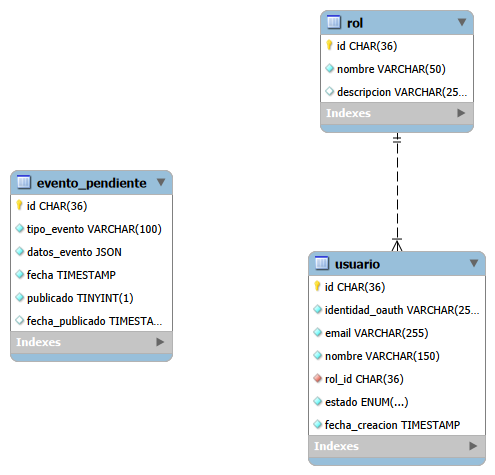

### Carga y aprobación de transacciones


### Adaptador del core

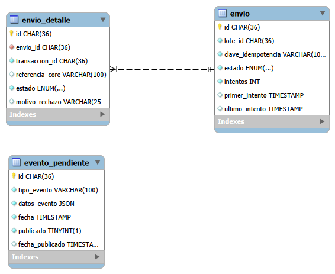

### Notificaciones

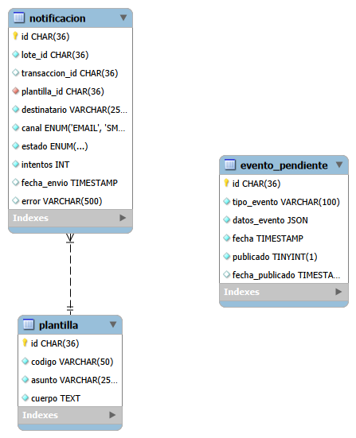

### Logging y auditoría

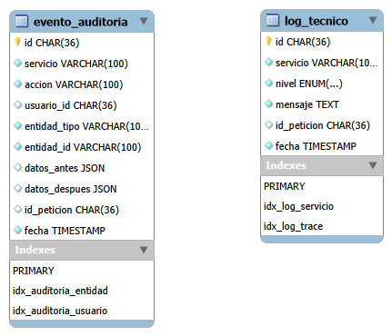

---

## 14. Diagramas de clases

Hay un diagrama por microservicio, y todos siguen las mismas convenciones:

Las entidades solo tienen métodos que operan sobre sus propios atributos, sin red ni base de datos: `marcarValidado()`, `puedeReintentar()`, `esValida()`. Tampoco reciben el identificador de su propia instancia, así que es `esValida()` y no `esValida(id: UUID)`.

Los servicios llevan el estereotipo `«service»` y son los que orquestan. Ahí vive la lógica que necesita red o persistencia. Por eso `login()` está en el servicio y no en la entidad `Usuario`: requiere hablar con OAuth, consultar el repositorio y usar la librería de cifrado, y una entidad que hace todo eso deja de ser una entidad.

Las interfaces `«interface»` cubren repositorios y clientes externos. Los servicios dependen de `EnvioRepository`, nunca de `EnvioRepositoryMySQL`.

Los DTO `«DTO»` no se persisten: transportan datos entre fronteras. `EventoLoteAprobado`, `RespuestaCore` y `ResultadoValidacion` son de este tipo, y por eso aparecen clases que no existen en el ER.

Las enumeraciones van como clasificadores aparte con `«enumeration»`, relacionadas con su clase por dependencia y no por asociación. Los atributos son privados y los métodos públicos.

Los diagramas de autenticación, carga y aprobación, adaptador del core, notificaciones y logging están en las secciones [5](#5-integración-con-la-práctica-2-identidad-federada), [6](#6-el-flujo-de-aprobación-de-tres-pasos), [9](#9-el-adaptador-del-core-y-la-idempotencia), [10](#10-notificación-a-los-beneficiarios) y [11](#11-logging-centralizado-y-auditoría), junto al texto que los explica.

---

## 15. Diagrama de componentes

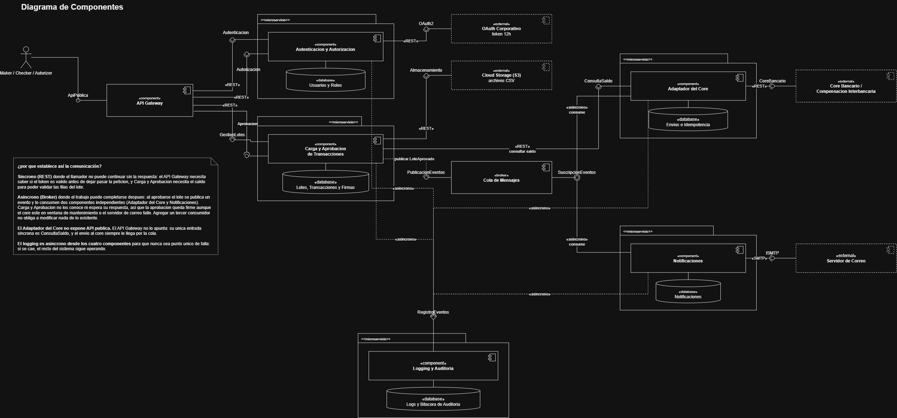

Cada microservicio se dibuja como un paquete `«microservicio»` que contiene su componente y su base de datos. Los sistemas externos llevan `«external»` y borde punteado.

Las conexiones usan conector de ensamblado: la bola (lollipop) va del lado del componente que provee la interfaz, el enchufe (socket) del lado del que la requiere, y el punto donde se encuentran es el contrato. Las flechas no apuntan a la caja del otro componente sino a su interfaz, que es la forma gráfica de la inversión de dependencias.

Interfaces del sistema: `IApiPublica`, `IAutenticacion`, `IAutorizacion`, `IGestionLotes`, `IAprobacion`, `IConsultaSaldo`, `IPublicacionEventos`, `ISuscripcionEventos`, `IRegistroEventos`, `IOAuth2`, `IAlmacenamiento`, `ICoreBancario` e `ISMTP`.

En UML el conector de ensamblado siempre se dibuja sólido, así que la diferencia entre síncrono y asíncrono la marcan los estereotipos `«REST»`, `«SMTP»` y `«asincrono»` sobre la línea del enchufe.

---

## 16. Diagramas de secuencia

Tres flujos críticos: la aprobación en tres pasos, el envío al core y la notificación a los beneficiarios. Los dos últimos arrancan del mismo evento y no se conocen entre sí.

### 16.1 Aprobación de transacciones en tres pasos

Este es el flujo central del sistema. Implementa el control maker-checker-authorizer y se divide en dos fases con propósitos distintos.

La fase 1 la ejecuta el sistema, sin intervención humana, y termina cuando cada fila del lote quedó marcada como válida o rechazada. La fase 2 es de aprobación humana: tres personas distintas firman sobre el lote ya validado, y ninguna revisa filas una por una.

```mermaid
%%{init: {'theme':'dark'}}%%
sequenceDiagram
    autonumber
    actor MK as Maker
    actor CK as Checker
    actor AZ as Authorizer
    participant GW as API Gateway
    participant AU as Autenticacion
    participant CA as Carga y Aprobacion
    participant S3 as Cloud Storage
    participant AD as Adaptador del Core
    participant MQ as Cola de Mensajes

    rect rgb(45, 45, 45)
    Note over MK,S3: FASE 1. Carga y validacion automatica

    MK->>GW: POST /lotes  (archivo CSV)
    GW->>AU: validar token y rol
    AU-->>GW: identidad + rol MAKER
    GW->>CA: cargarLote(archivo, usuarioId)
    CA->>S3: guardar original.csv
    S3-->>CA: archivoKey
    CA-->>GW: loteId, estado CARGADO
    GW-->>MK: 202 Accepted + loteId

    CA->>CA: validar formato, cuentas y limites
    CA->>AD: consultarSaldos(cuentas distintas)
    AD-->>CA: mapa de cuenta y saldo disponible
    CA->>CA: verificar saldo acumulando el monto<br/>ya comprometido por cada cuenta
    CA->>S3: guardar resultado.csv
    CA->>CA: estado del lote = VALIDADO
    end

    rect rgb(62, 62, 62)
    Note over MK,AZ: FASE 2. Flujo de aprobacion de 3 pasos

    MK->>GW: GET /lotes/:id/resultado
    GW->>CA: consultarLote(loteId)
    CA-->>GW: 1950 validas, 50 rechazadas
    GW-->>MK: resumen + enlace de descarga

    Note over MK: PASO 1. El maker declara que el lote esta listo.<br/>Subir y corregir el CSV no cuenta como firma.

    MK->>GW: POST /lotes/:id/firmas  (paso 1)
    GW->>CA: firmarPaso(loteId, usuarioId, 1, APROBADA)
    CA->>CA: validarSeparacionFunciones()
    CA->>CA: registrar Firma paso 1
    CA->>CA: estado del lote = EN_APROBACION
    CA-->>MK: firma registrada

    Note over CK: PASO 2. El checker revisa el resultado ya validado.<br/>Puede excluir filas individuales sin firmar cada una.

    CK->>GW: GET /lotes/:id
    GW->>CA: consultarLote(loteId)
    CA-->>CK: lote + estado de cada transaccion

    opt El checker excluye filas puntuales
        CK->>GW: POST /transacciones/:id/excluir
        GW->>CA: excluirTransaccion(transaccionId, usuarioId)
        CA->>CA: estado de la transaccion = EXCLUIDA
    end

    CK->>GW: POST /lotes/:id/firmas  (paso 2)
    GW->>CA: firmarPaso(loteId, usuarioId, 2, APROBADA)
    CA->>CA: validarSeparacionFunciones()

    alt El firmante ya firmo un paso anterior
        CA-->>CK: 403. Separacion de funciones violada
    else Firmante distinto y con rol CHECKER
        CA->>CA: registrar Firma paso 2
        CA-->>CK: firma registrada
    end

    Note over AZ: PASO 3. El authorizer autoriza el movimiento de dinero.

    AZ->>GW: POST /lotes/:id/firmas  (paso 3)
    GW->>CA: firmarPaso(loteId, usuarioId, 3, APROBADA)
    CA->>CA: validarSeparacionFunciones()
    CA->>CA: registrar Firma paso 3
    CA->>CA: estado del lote = APROBADO
    CA-)MQ: publicar evento LoteAprobado
    CA-->>AZ: lote aprobado
    end

    Note over CA,MQ: Carga y Aprobacion publica un evento y termina.<br/>No conoce al Adaptador ni a Notificaciones.
```

Por qué el diagrama quedó así:

La validación no bloquea al maker. El sistema responde de inmediato con el `loteId` y valida en segundo plano, porque un lote de doscientas mil filas tarda minutos y ninguna sesión HTTP aguanta esa espera.

El saldo se valida antes de que entren los humanos, una vez por cuenta distinta y acumulando el monto ya comprometido dentro del lote. El detalle de por qué está en la [sección 6.4](#64-dónde-se-valida-el-saldo).

El paso 1 no es subir el archivo. Es la declaración de que el lote está listo para revisión.

La firma es sobre el lote, y aun así el checker puede excluir filas puntuales, porque el estado de cada transacción vive en su propia entidad.

`validarSeparacionFunciones()` corre en los tres pasos. Sin ella, alguien con permisos amplios podría cargar un lote a su favor y firmarlo tres veces.

### 16.2 Envío al sistema core bancario

Este flujo arranca solo cuando el evento `LoteAprobado` llega a la cola. El Adaptador del Core no expone API pública: ningún usuario lo invoca y el gateway no lo apunta.

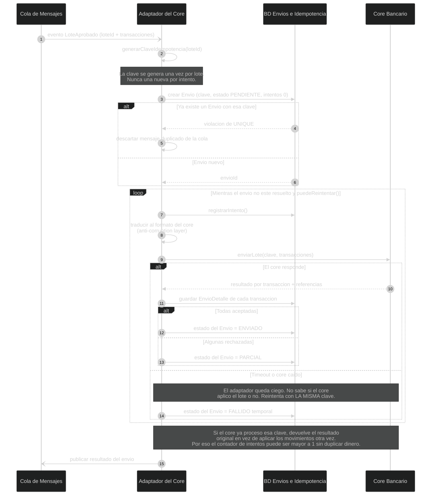

Por qué el diagrama quedó así:

La clave de idempotencia es lo que vuelve seguro el reintento, y se genera una vez por lote. El argumento completo está en la [sección 9.2](#92-la-idempotencia-es-lo-importante-de-este-servicio).

El estado `PARCIAL` existe porque el core responde por transacción, y un envío con 199,950 aceptadas y 50 rechazadas no es exitoso ni fallido.

La traducción al formato del core está aislada en este componente. Si el banco cambia de proveedor, ningún otro microservicio se entera.

La aprobación queda firme aunque el core esté caído. El envío llega por cola, así que un lote aprobado durante la ventana de mantenimiento espera y sale cuando el core vuelve.

### 16.3 Notificación a los beneficiarios

Este flujo consume el mismo evento que el anterior, de forma independiente. Notificaciones y Adaptador del Core no se conocen entre sí.

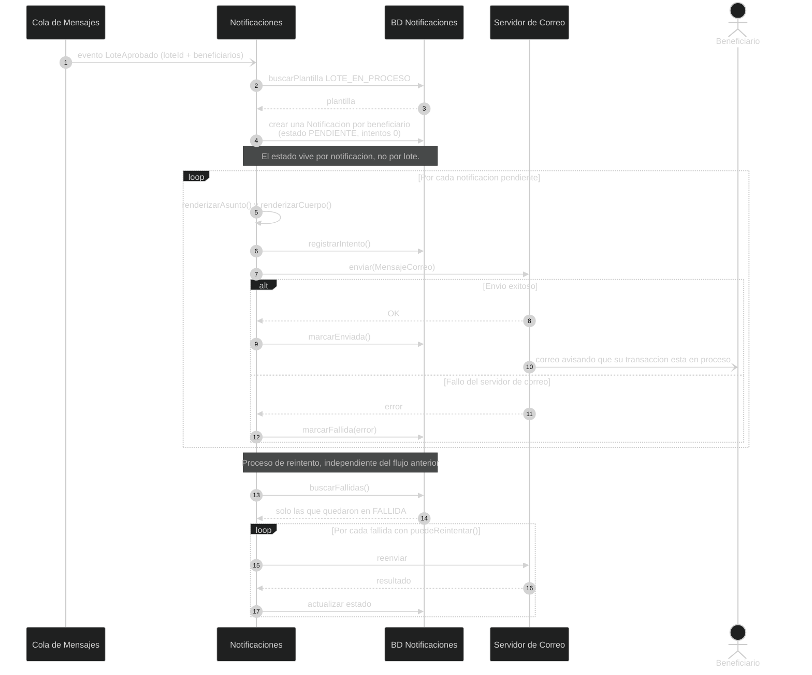

Por qué el diagrama quedó así:

El estado vive por notificación. Si fuera del lote completo y el envío fallara en el correo 150,000, al reintentar cada uno de los 149,999 clientes ya avisados recibiría el mismo correo dos veces.

Nadie llama a Notificaciones, consume de la cola. Con una llamada REST desde el servicio de aprobación, el authorizer esperaría a que salieran miles de correos antes de recibir su respuesta.

Un evento, dos consumidores independientes. El mismo `LoteAprobado` alimenta el envío al core y la notificación, sin que ninguno sepa del otro.

---

## 17. Los cinco principios SOLID en este diseño

SOLID se enseña con clases, pero los mismos cinco principios se leen a nivel de arquitectura. Cada uno tiene evidencia concreta en estos diagramas.

### Responsabilidad única

El corte de los cinco microservicios es este principio aplicado en grande: cada servicio tiene una razón para cambiar. Si cambian las reglas de validación del CSV, se toca Carga y Aprobación. Si el banco cambia de proveedor de core, se toca el Adaptador. Si cambia la política de retención de logs, se toca Logging. Ningún cambio de esos obliga a mover otro servicio.

Dentro de cada servicio pasa lo mismo. `ServicioRegistro` y `ServicioConsulta` están separados porque escribir un lote y consultarlo cambian por motivos distintos. Y `login()` vive en el servicio, no en la entidad `Usuario`, porque necesita OAuth, repositorio y cifrado: meterlo en la entidad le habría dado cuatro razones para cambiar.

### Abierto/cerrado

La cola es el ejemplo más claro. Agregar un consumidor nuevo, digamos reportería, no modifica una sola línea de Carga y Aprobación: el servicio nuevo se suscribe al evento que ya se publica. El sistema queda abierto a extensión y cerrado a modificación en el punto donde más cambios se esperan.

El servicio de logging aplica lo mismo con `registrarLog()` y `registrarAuditoria()` genéricos. Un microservicio nuevo manda sus eventos con su nombre en el campo `servicio` y no hay que tocar el de logging.

### Sustitución de Liskov

Cualquier implementación de `ClienteCoreBancario` es intercambiable sin que el Adaptador se entere, y lo mismo vale para `ClienteCorreo` en Notificaciones. Un cliente de pruebas que devuelve respuestas simuladas y el cliente real del core cumplen el mismo contrato, así que el servicio funciona igual con cualquiera de los dos. Eso es lo que hace testeable el flujo del core sin tener el core.

### Segregación de interfaces

El Adaptador del Core provee `IConsultaSaldo` y nada más. Carga y Aprobación solo necesita el saldo, y darle una interfaz gorda con el envío al core incluido la habría dejado dependiendo de operaciones que jamás usa.

Igual pasa con la cola: `IPublicacionEventos` e `ISuscripcionEventos` están separadas porque quien publica no necesita saber suscribirse. En el diagrama de componentes esto se ve directo, cada enchufe pide solo lo que usa.

### Inversión de dependencias

Los servicios dependen de `EnvioRepository`, no de `EnvioRepositoryMySQL`. La lógica de negocio no sabe qué motor de base hay debajo, y cambiar de motor no la toca.

A nivel de arquitectura se ve en el diagrama de componentes: ninguna flecha apunta a la caja de otro componente, todas apuntan a una interfaz. Los dos extremos dependen del contrato, no uno del otro.

---

## 18. Tecnologías propuestas y por qué

| Pieza | Tecnología | Por qué en este contexto |
|---|---|---|
| API Gateway | Kong Gateway | Validación de JWT, correlation ID y rate limiting como plugins declarativos, sin código propio en la frontera de seguridad. Ver [sección 8.3](#83-qué-tecnología-propongo) |
| Microservicios | NestJS con TypeScript | Es el stack del módulo de la Práctica 2, que se reutiliza tal cual. Su inyección de dependencias empuja de forma natural hacia interfaces |
| Bases de datos | MySQL 8, una por servicio | Los datos son transaccionales y relacionales, y el dinero exige ACID. Cinco instancias independientes sostienen database per service |
| Cola de mensajes | RabbitMQ | Un exchange fanout entrega el mismo `LoteAprobado` a dos consumidores independientes, con ack por mensaje y cola de mensajes muertos para lo que falla |
| Almacenamiento | Amazon S3 | Objetos grandes, costo bajo, versionado, cifrado en reposo y bloqueo de objetos para la evidencia de auditoría |
| Autenticación | OAuth 2.0 más JWT en cookie HTTP-only con AES | El OAuth corporativo da la identidad, la sesión propia da los roles. Ver [sección 5](#5-integración-con-la-práctica-2-identidad-federada) |
| Correo | SMTP corporativo | La entrega es síncrona porque el servicio necesita saber si el correo salió para marcar la notificación |

Sobre RabbitMQ y Kafka: Kafka brilla con flujos de altísimo volumen y con la necesidad de reproducir el historial de eventos. Aquí el volumen es de un mensaje por lote aprobado, no de un mensaje por transacción, y la evidencia histórica ya la resuelve la bitácora de auditoría. Lo que sí necesito es enrutamiento por exchange, confirmación por mensaje y reintentos con cola de mensajes muertos, que es justo el terreno de RabbitMQ. Kafka aquí sería operar un clúster para un problema que no tengo.

Sobre el motor de base: el módulo de la Práctica 2 se implementó sobre PostgreSQL con TypeORM. Como el acceso a datos pasa por el ORM y por interfaces de repositorio, mover ese servicio a MySQL cambia la configuración de conexión y las migraciones, no el código de dominio. Es el mismo argumento de la inversión de dependencias, cobrado en la práctica.

Patrones que sostienen el diseño, con el lugar donde se ven:

| Patrón | Dónde |
|---|---|
| API Gateway pattern | [Sección 8](#8-propuesta-de-api-gateway) |
| Database per service | [Sección 13](#13-modelo-de-datos-un-er-por-microservicio) |
| Anti-corruption layer | [Sección 9.1](#91-anti-corruption-layer) |
| Idempotencia | [Sección 9.2](#92-la-idempotencia-es-lo-importante-de-este-servicio) |
| Transactional outbox | [Sección 11.4](#114-que-ninguna-acción-quede-sin-registro) |
| Identidad federada | [Sección 5](#5-integración-con-la-práctica-2-identidad-federada) |
| Segregación de funciones | [Sección 6.3](#63-segregación-de-funciones) |
| Procesamiento asíncrono | [Secciones 6.5 y 7](#65-la-carga-es-asíncrona) |
| Correlation ID | [Sección 11.3](#113-seguir-una-petición-por-los-cinco-servicios) |
| Evitar el problema N+1 | [Sección 6.4](#64-dónde-se-valida-el-saldo) |

---

## 19. Supuestos declarados

Prefiero decir dónde asumí algo a que se note después:

El alcance es batch. El enunciado habla de cargas masivas por CSV y no menciona operaciones individuales, así que todo el diseño gira alrededor del lote.

No se modelan retiros. El enunciado menciona transferencias masivas, pagos en lote y depósitos en lote; los retiros no aparecen y no los inventé.

El correo del beneficiario viene en el CSV. Sin ese dato, Notificaciones tendría que consultar el core por cada beneficiario y volveríamos al problema N+1.

El período de retención de los CSV lo define la normativa bancaria aplicable. La arquitectura deja el bloqueo de objetos y la política de ciclo de vida listos; el número de años lo pone cumplimiento, no el diseño.

La sesión es stateless por decisión, con el costo de revocación ya explicado en la sección 5.

La ventana de mantenimiento del core y su indisponibilidad ocasional se asumen como escenario normal, no como excepción. Todo el diseño del adaptador parte de que el core se va a caer alguna vez.
