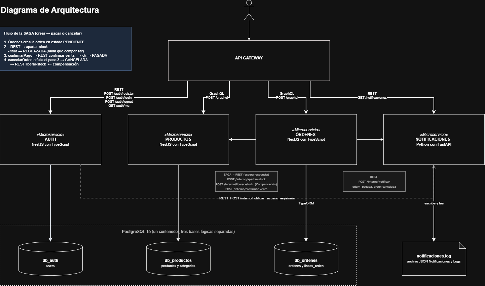
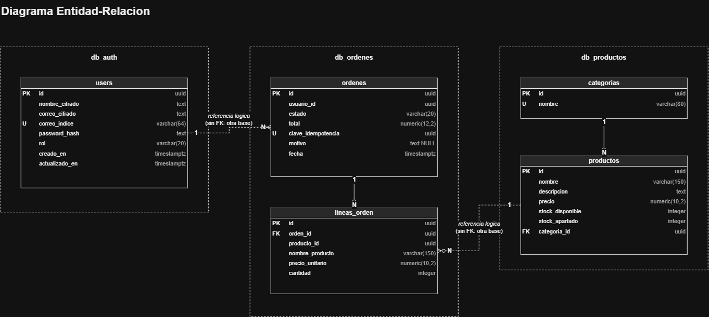
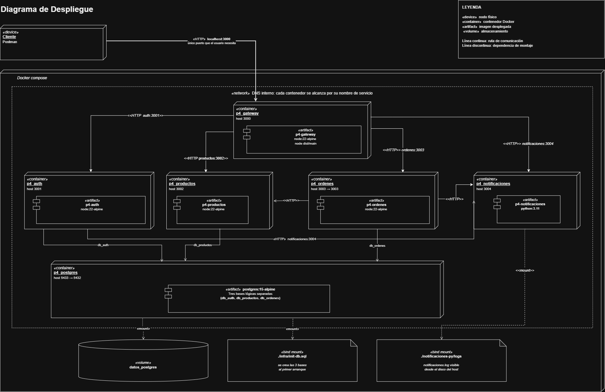

<p align="left">
Universidad San Carlos de Guatemala<br>
Facultad de Ingeniería<br>
Ingeniería en ciencias y sistemas<br>
Laboratorio de Software Avanzado 

Nombre: Sergio Joel Rodas Valdez<br>
Carné: 202200271
</p>


# Práctica 4: Sistema de microservicios

Una tienda en línea partida en cuatro microservicios, con un API Gateway como única puerta de entrada. Todo levanta con un comando.

## Índice

1. [Qué hace el sistema](#qué-hace-el-sistema)
2. [Tecnologías](#tecnologías)
3. [Cómo levantarlo](#cómo-levantarlo)
4. [Distribución de los microservicios](#distribución-de-los-microservicios)
5. [Comunicación entre servicios](#comunicación-entre-servicios)
6. [Diagramas](#diagramas)
7. [El API Gateway](#el-api-gateway)
8. [Clave de idempotencia](#clave-de-idempotencia)
9. [La saga](#la-saga)
10. [Principios SOLID](#principios-solid)
11. [Contratos de la API](#contratos-de-la-api)

---

## Qué hace el sistema

Un usuario se registra, inicia sesión, consulta el catálogo, crea una orden y la paga o la cancela. Cuando cancela, el stock que tenía reservado vuelve al catálogo. Esa devolución es la parte interesante y tiene su propia sección más abajo.

---

## Tecnologías

| Capa | Herramienta | 
|---|---|
| Gateway, Auth, Productos, Órdenes | NestJS con TypeScript |
| Notificaciones | Python con FastAPI | 
| API de consulta | GraphQL con Apollo Server |
| Base de datos | PostgreSQL |
| ORM | TypeORM |
| Validación de entrada | class-validator, Joi |
| Llamadas entre servicios | axios y fetch nativo | 
| Contenedores | Docker y Docker Compose |

Los cuatro servicios de Node corren sobre `node:22-alpine`. Notificaciones corre sobre `python:3.11-slim`.

---

## Cómo levantarlo

```bash
cd P4
docker compose up -d --build
```

Seis contenedores arrancan en orden: Postgres y Notificaciones primero, luego Auth y Productos, después Órdenes y al final el Gateway. El orden lo garantizan los `depends_on` con `service_healthy`, así ningún servicio arranca antes que su dependencia.

Para verificar:

```bash
docker compose ps
```

como bajarlo 

```bash
docker compose down
```

eliminar los contenedores

```bash
docker compose down -v
```

---

## Distribución de los microservicios

| Servicio | Puerto | Lenguaje | Es dueño de |
|---|---|---|---|
| gateway | 3000 | TypeScript | nada, solo enruta |
| auth | 3001 | TypeScript | `users` en `db_auth` |
| productos | 3002 | TypeScript | `productos`, `categorias` en `db_productos` |
| ordenes | 3003 | TypeScript | `ordenes`, `lineas_orden` en `db_ordenes` |
| notificaciones | 3004 | Python | ningún dato, solo un archivo de log |

Cada servicio tiene su propia base y ninguno puede leer la de otro. A cada contenedor se le pasa **solo** la URL de su base. Órdenes no conoce la dirección de `db_productos` ni aunque quisiera consultarla esto es databse por service.

Las tres bases viven dentro de un mismo contenedor de Postgres. En producción serían tres instancias separadas, pero el aislamiento lógico ya es real: conexiones distintas, sin consultas cruzadas, sin llaves foráneas entre bases.

Notificaciones no tiene base de datos, y vale la pena notarlo: un microservicio no necesita una solo porque los demás la tengan. Guarda su historial en un archivo y con eso le alcanza.

---

## Comunicación entre servicios

Todo es HTTP. Sin broker, sin colas, sin eventos.

| Origen | Destino | Para qué |
|---|---|---|
| Gateway | Auth | registrar, login, logout, validar la sesión |
| Gateway | Productos | consultas GraphQL del catálogo |
| Gateway | Órdenes | consultas GraphQL de órdenes |
| Gateway | Notificaciones | historial de avisos del usuario |
| Órdenes | Productos | apartar, liberar y confirmar stock |
| Órdenes | Notificaciones | avisar orden pagada o cancelada |
| Auth | Notificaciones | avisar usuario registrado |

Los servicios se encuentran por nombre (`http://productos:3002`), no por IP. Docker resuelve esos nombres con su DNS interno dentro de la red `red_p4`.

Hay una diferencia entre esas llamadas que conviene tener clara. Cuando Órdenes le pide a Productos que aparte stock, **espera la respuesta**, porque de ella depende si la orden sigue o se rechaza. Cuando le avisa a Notificaciones, no espera nada: la orden ya está pagada y el negocio ya ocurrió. Que el aviso salga o no salga no cambia ningún dato. Por eso, si Notificaciones está caído, la compra se completa igual y solo queda una advertencia en el log.

---

## Diagramas

### Arquitectura




### Entidad-relación




En todo el sistema hay **dos** llaves foráneas reales (`productos.categoria_id` y `lineas_orden.orden_id`). Las otras dos relaciones, `ordenes.usuario_id` y `lineas_orden.producto_id`, apuntan a tablas que viven en otra base, así que Postgres no puede crear la llave foránea. La integridad la mantiene la aplicación.
es decir cada servicio cuenta con su propia base de datos

### Despliegue



---

## El API Gateway

 Un solo punto de entrada público que recibe todo el tráfico del exterior y lo reparte a quien corresponda. El cliente solo conoce el puerto 3000. Nunca habla con Auth, Productos u Órdenes de forma directa.

Tres cosas viven en el gateway y por eso no se repiten en los demás servicios:

- validación de la sesión
- CORS, porque es el único servicio al que llama un navegador
- el `ValidationPipe` global que rechaza cuerpos malformados antes de reenviarlos

La decisión de diseño que más cuesta explicar está en [sesion.guard.ts](backend-ts/gateway/src/auth/sesion.guard.ts): el gateway **no verifica la firma del JWT**. Le reenvía la cookie a Auth y le pregunta de quién es la sesión, llamando a `GET /auth/me`.

Cuesta un salto HTTP extra por cada petición protegida. A cambio: la lógica del token queda en un solo lugar, el `JWT_SECRET` vive en un solo contenedor, y la renovación automática del token sigue funcionando sin duplicar una línea de código.

Después de resolver quién es el usuario, el gateway se lo pasa a los demás servicios en headers simples (`x-usuario-id`, `x-usuario-rol`, `x-usuario-correo`). Productos y Órdenes leen esos headers y aplican sus propias reglas de permiso. Auth responde quién sos, cada servicio decide qué podés hacer.

Para GraphQL el gateway funciona como un cartero: toma la consulta y la reenvía tal cual al servicio que corresponde, sin entenderla. No usa Apollo Federation. El costo es que un cliente que necesite datos de Productos y de Órdenes tiene que hacer dos llamadas. 

---

## Clave de idempotencia

El problema: alguien hace doble clic en "comprar". Llegan dos peticiones idénticas y se crean dos órdenes.

La solución: el cliente genera un UUID antes de mandar la orden y lo incluye en la petición. Ese valor tiene una restricción `UNIQUE` en la base. Si llega repetido, el servidor devuelve la orden que ya existía en vez de crear otra.

Lo importante es que el UUID lo genera **el cliente**, no el servidor. Si lo generara el servidor, cada reintento llevaría una clave distinta, y una clave distinta crea una orden distinta. Justo lo que se quiere evitar. Así el cliente puede reintentar sin miedo cuando se le cae la conexión y no sabe si su orden llegó.

La comprobación está en dos niveles ([ordenes.service.ts](backend-ts/ordenes/src/ordenes/ordenes.service.ts)): primero se busca si la clave ya existe, y además hay un `try/catch` que atrapa el choque contra el índice único. El segundo es el que importa cuando dos peticiones llegan al mismo tiempo, porque las dos pueden pasar la búsqueda inicial y solo la base puede resolver el empate.

---

## SAGA

Cuando alguien compra, pasan dos cosas en dos lugares distintos: se crea la orden en `db_ordenes` y se aparta el stock en `db_productos`.

Si las dos vivieran en la misma base, existiría un `ROLLBACK` que deshace ambas de una vez cuando algo falla. Pero son bases separadas y Postgres no tiene forma de coordinarlas. Ese es el problema que resuelve SAGA.

La idea es simple: si no hay un botón mágico de "deshacer", entonces cada paso necesita un paso contrario, y alguien tiene que ir llamándolos en orden. Ese alguien es Órdenes.

```
crearOrden
  1. Se guarda la orden como PENDIENTE
  2. Se le pide a Productos que aparte el stock
       sin stock  -> la orden queda RECHAZADA (no hay nada que deshacer)
       con stock  -> sigue

confirmarPago
  3. Se le confirma la venta a Productos
       falla -> la orden se CANCELA y se libera el stock
       ok    -> la orden queda PAGADA

cancelarOrden
  4. Se libera el stock reservado   <- esto es la compensación
```

La compensación es el paso 4, y es la operación opuesta a apartar. Lo que se restó del stock disponible, se devuelve. Vive en [saga.service.ts](backend-ts/ordenes/src/ordenes/saga.service.ts).

Hay un caso feo que vale la pena mencionar porque lo probé: si Productos se cae justo entre apartar y confirmar, la compensación tampoco puede correr (el servicio que la ejecuta es el mismo que está caído). La orden se cancela igual y queda un error en el log pidiendo revisión manual. Es el límite real de este patrón y no lo escondí.

---

## Principios SOLID

Los cinco aplican, pero no todos con la misma fuerza. Van con el archivo donde se ve cada uno.

### S. Responsabilidad única

Una clase, un motivo para cambiar.

`AuthService` verifica credenciales y produce un token. No toca cookies ni objetos de respuesta, eso lo hace `CookieService`. El comentario está en el propio archivo:

```ts
// esta clase solo verifica credenciales y produce un token, no toca cookies ni response
// quien guarda el token en la cookie es el controlador, que tiene acceso a response
```
[auth.service.ts](backend-ts/auth/src/auth/auth.service.ts)

Lo mismo en Productos, donde el CRUD del catálogo y los movimientos de stock están separados a propósito:

```ts
// Este servicio no toca las columnas de stock apartado. Todo el movimiento de
// stock vive en StockService, porque es lo que participa en la saga
```
[catalogo.service.ts](backend-ts/productos/src/catalogo/catalogo.service.ts)

Y en Órdenes: `OrdenesService` crea y consulta, `SagaService` coordina pagar y cancelar.

### O. Abierto/cerrado

Abierto a extenderse, cerrado a modificarse.

`GraphqlClienteService` recibe la URL del servicio como parámetro en vez de tenerla adentro:

```ts
async reenviar(opciones: {
  urlDelServicio: string;
  consulta: unknown;
  headersDeIdentidad: Record<string, string>;
})
```
[graphql-cliente.service.ts](backend-ts/gateway/src/graphql-proxy/graphql-cliente.service.ts)

Hoy lo usan dos controladores, Productos y Órdenes. Si mañana aparece un tercer servicio con GraphQL, se agrega un controlador nuevo y esta clase no se toca.

### L. Sustitución de Liskov

Cualquier implementación de un contrato debe poder usarse donde se espera ese contrato.

Cuatro guards distintos implementan `CanActivate`: `JwtAuthGuard` y `RolesGuard` en Auth, `SesionGuard` en el gateway, `SoloAdminGuard` en Productos. Nest los trata a todos igual, los pone en `@UseGuards()` sin saber cuál es cuál y sin ningún caso especial.

Curioso el detalle: `SesionGuard` valida por HTTP contra otro servicio y `SoloAdminGuard` solo lee un header. Por dentro no se parecen en nada. Para quien los usa, son intercambiables.

### I. Segregación de interfaces

Nadie debería depender de cosas que no usa.

Cada servicio define su propio `ServiciosConfig` con **solo** las direcciones que necesita:

```ts
// ordenes: solo habla con estos dos
export interface ServiciosConfig {
  productos: string;
  notificaciones: string;
}
```
[ordenes/servicios.config.ts](backend-ts/ordenes/src/config/servicios.config.ts)

```ts
// auth: solo necesita una
export interface ServiciosConfig {
  notificaciones: string;
}
```
[auth/servicios.config.ts](backend-ts/auth/src/config/servicios.config.ts)

El gateway sí declara las cuatro, porque es el único que habla con todos. Una interfaz compartida con las cuatro URLs habría obligado a Auth a conocer direcciones que nunca va a usar.

### D. Inversión de dependencias

Depender de contratos, no de implementaciones concretas.

Se ve en dos niveles. Dentro de cada servicio, las clases reciben lo que necesitan por constructor y nunca leen `process.env` por su cuenta:

```ts
constructor(@Inject(serviciosConfig.KEY) private readonly servicios: ServiciosConfig) {}
```
[auth-cliente.service.ts](backend-ts/gateway/src/auth/auth-cliente.service.ts)

Entre servicios se ve más claro todavía. Órdenes depende de Productos, pero no importa ni una sola clase suya: lo único que comparten es la forma del JSON que viaja por HTTP, declarada en [productos.cliente.ts](backend-ts/ordenes/src/clientes/productos.cliente.ts). Si Productos se reescribiera mañana en Go, Órdenes no se enteraría.

Una aclaración honesta: no creé interfaces con una sola implementación para forzar el principio. Habría sido código de adorno.

---

## Contratos de la API

Todos los endpoints, con su ruta, cuerpo, respuesta y códigos de error, están documentados aparte:

**[Contratos.md](Contratos.md)**

Incluye la configuración de Postman, las consultas GraphQL listas para pegar y un flujo de prueba de 13 pasos que termina demostrando la compensación de la saga.

## Postman Workspace
[Postman Workspace](https://www.postman.com/delevop-microservices/workspace/practica-4)