<p align="left">
Universidad San Carlos de Guatemala<br>
Facultad de Ingeniería<br>
Ingeniería en ciencias y sistemas<br>
Laboratorio de Software Avanzado 

Nombre: Sergio Joel Rodas Valdez<br>
Carné: 202200271
</p>


# Práctica 5 - Orquestación con Kubernetes con Helm

## Qué hice

Agarré los cinco microservicios de la P4, que corrían con Docker Compose y se
hablaban solo por HTTP, y los llevé a Kubernetes empaquetados como un chart de
Helm.

Los cambios de fondo respecto a la práctica anterior:

- **Notificaciones dejó de ser un servidor web.** Ahora consume una cola de
  RabbitMQ. Auth y Órdenes publican el aviso y siguen su camino sin esperar
  respuesta.
- **Postgres vive dentro del clúster** como StatefulSet con disco propio. Una
  sola instancia con cinco bases adentro, una por microservicio.
- **Solo el gateway es alcanzable desde afuera**, y a través de un Ingress. Todo
  lo demás quedó cerrado con NetworkPolicies.
- **Dos cronjobs encadenados**: uno escribe en la bitácora cada 2 minutos, el
  otro la resume cada 10 y publica el resultado en la misma cola.

Toda la plataforma se instala con un solo `helm install`. No hay ni un `kubectl apply -f` en el proceso.

---

## 1. Arquitectura

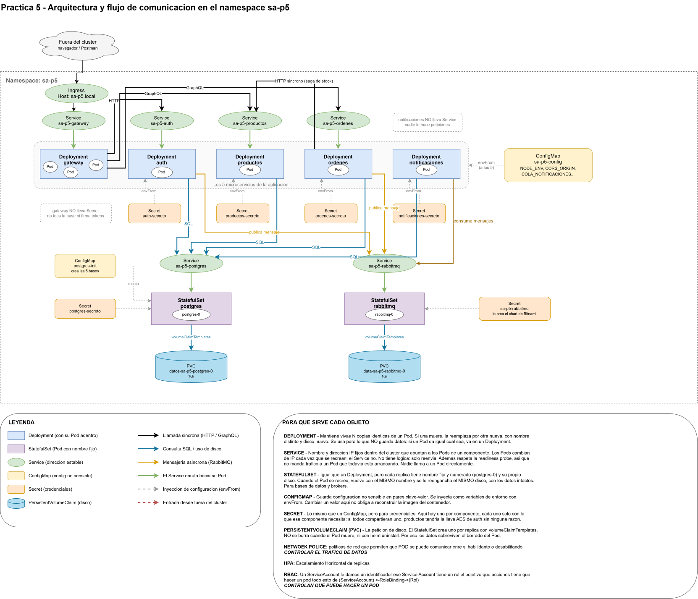


### Qué queda dentro y qué queda fuera del clúster

Fuera hay una sola cosa: el navegador o Postman con los que pego a
`http://sa-p5.local`. Adentro del namespace `sa-p5` vive todo lo demás.

La única puerta es el Ingress. Detrás de él, el gateway reparte a los
microservicios, y ninguno de esos es alcanzable desde afuera porque todos los
Services son de tipo `ClusterIP`. Ni Postgres ni RabbitMQ se exponen.

### Los dos flujos

**Síncrono.** El gateway le pega por HTTP a auth, productos y órdenes, y espera
la respuesta. Órdenes también le pega a productos para apartar stock durante la
saga. Esa es la única llamada lateral entre microservicios que permití.

**Asíncrono.** Auth y Órdenes publican en la cola y retornan de una vez.
Notificaciones la consume por su cuenta, a su ritmo. Si notificaciones está
caído, los mensajes se quedan esperando y nadie más se entera.

### Lo que bloquean las NetworkPolicies

Arranqué negando todo el tráfico del namespace y después abrí solo lo necesario:

| Destino | Quién puede entrar |
|---|---|
| gateway | Solo el Ingress Controller |
| auth, órdenes | Solo el gateway |
| productos | El gateway, y órdenes para la saga |
| Postgres | Los cuatro microservicios con base propia y los dos cronjobs |
| RabbitMQ | Auth, órdenes, notificaciones y el cronjob de resumen |

Todo lo que no esté en esa tabla queda bloqueado. Un pod suelto que alguien
levante en el namespace no llega a la base ni al broker.

---

## 2. Levantar todo desde cero

Los comandos completos, con sus explicaciones, están en
[`comandos.md`](comandos.md). Este es el camino corto.

```powershell
# 1. Docker Desktop arriba
docker info

# 2. Clúster con Calico. Sin este CNI las NetworkPolicies se crean pero no bloquean nada
minikube start --driver=docker --cni=calico --memory=4096 --cpus=4

# 3. Addons
minikube addons enable ingress
minikube addons enable metrics-server

# 4. Construir las imagenes desde el codigo de P4
docker compose -f P4/docker-compose.yml build
docker build -t p5-cron-bitacora:1.0.1 P5/cronjobs/bitacora
docker build -t p5-cron-resumen:1.0.0 P5/cronjobs/resumen

# 5. Cargarlas en minikube (su almacen es aparte del de Docker Desktop)
minikube image load p4-gateway:1.1.0
minikube image load p4-auth:1.1.0
minikube image load p4-productos:1.1.0
minikube image load p4-ordenes:1.1.0
minikube image load p4-notificaciones:1.2.0
minikube image load postgres:15-alpine
minikube image load bitnamilegacy/rabbitmq:4.1.3-debian-12-r1
minikube image load p5-cron-bitacora:1.0.1
minikube image load p5-cron-resumen:1.0.0

# 6. Bajar las dependencias del chart
helm dependency update ./P5/charts/sa-platform

# 7. Credenciales (una sola vez). Copiar el ejemplo y reemplazar los CAMBIAME
copy P5\charts\sa-platform\values.example.yaml P5\charts\sa-platform\values.secretos.yaml

# 8. Validar
helm lint ./P5/charts/sa-platform -f ./P5/charts/sa-platform/values-dev.yaml -f ./P5/charts/sa-platform/values.secretos.yaml

# 9. Instalar
helm install sa-p5 ./P5/charts/sa-platform -f ./P5/charts/sa-platform/values-dev.yaml -f ./P5/charts/sa-platform/values.secretos.yaml

# 10. Abrir el acceso. EN OTRA TERMINAL, COMO ADMINISTRADOR
minikube tunnel
```

Con eso queda funcionando en `http://sa-p5.local/health`.

### Dos cosas que no son obvias

`minikube tunnel` solo hace falta en Windows con el driver de Docker. El clúster
vive dentro de un contenedor y su red no se alcanza desde la máquina. En un
clúster real el Ingress tendría IP pública y esto no existiría. Además, el
archivo `hosts` de Windows necesita la línea `127.0.0.1 sa-p5.local`. esto lo deseo mencionar

Las credenciales van en un archivo aparte que está en `.gitignore`. En
`values.yaml` quedan vacías y el chart falla con `required` si no se pasan.

---

## 3. Tamaño de las imágenes

La columna de la izquierda es lo que pesaría cada imagen sin multi-stage. No la
inventé: construí solo la primera etapa de cada Dockerfile, que todavía carga el
compilador, las dependencias de desarrollo y el código fuente.

| Imagen | Sin optimizar | Optimizada | Reducción |
|---|---|---|---|
| `p4-auth` | 700 MB | 557 MB | 143 MB |
| `p4-gateway` | 481 MB | 388 MB | 93 MB |
| `p4-ordenes` | 572 MB | 565 MB | 7 MB |
| `p4-productos` | 566 MB | 554 MB | 12 MB |
| `p4-notificaciones` | 216 MB | 200 MB | 16 MB |


```powershell
# Asi se midio la columna "sin optimizar"
docker build --target compilacion -t medicion-auth:sinoptimizar P4/backend-ts/auth
```

---

## 4. Evidencias

### 4.1 Ciclo de vida con Helm: upgrade y rollback

Publiqué tres versiones del chart. La `0.5.0` la rompí a propósito apuntando el
gateway a una imagen que no existe, para tener algo real que revertir.

| Revisión | Chart | Qué pasó |
|---|---|---|
| 19 | `0.4.0` | Upgrade con un cambio real de configuración |
| 20 | `0.5.0` | Versión rota (imagen inexistente) |
| 21 | `0.4.0` | `Rollback to 19` |

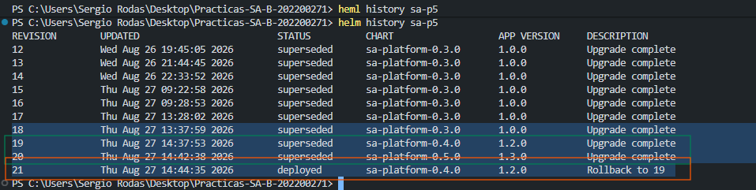

Lo interesante del despliegue roto: el pod nuevo se quedó en `ErrImageNeverPull`
pero el viejo siguió `1/1 Running` y el servicio nunca dejó
de responder. Kubernetes no mata el pod bueno hasta que el nuevo pase su
readiness, y como nunca pasó, el despliegue quedó atascado sin tumbar nada.

### 4.2 Actualización sin downtime

Dejé una sonda pegándole cada 200 ms durante 3 minutos y, con eso corriendo, lancé el upgrade que reemplaza los cinco microservicios.

```
RESULTADO exitosas=808 fallidas=0
```

808 peticiones seguidas, ni un error, mientras los cinco pods se reemplazaban.
Eso lo hace `maxUnavailable: 0`: obliga a que el pod nuevo esté listo antes de
bajar el viejo.


### 4.3 Escalado por HPA bajo carga

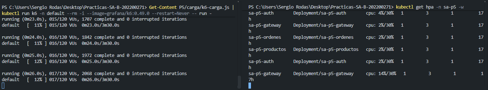

```
Antes de la carga : cpu:   2%/30%   a  1 replica
Durante el pico   : cpu: 522%/30%   a  3 replicas
Al cesar la carga : cpu:   2%/30%   a  3 replicas (ventana de estabilizacion)
60s despues       : cpu:   2%/30%   a  1 replica
```

522% contra un umbral de 30%. Con ese número el HPA ni lo pensó: saltó de 1 a 3
réplicas sin pasar por 2, y el techo era 3. Para bajar sí se tomó su tiempo, por la ventana de estabilización de 60 segundos.

### 4.4 Persistencia tras borrar el pod de la base

Registré un usuario por el gateway, anoté el volumen y el identificador del pod,
borré el pod de Postgres y volví a consultar.

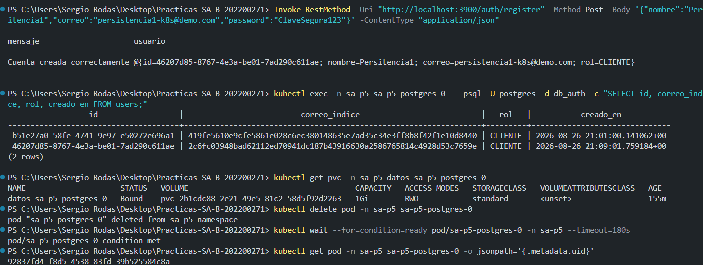

El pod es otro (cambió su UID interno), pero el volumen es el mismo y las filas
siguen ahí. Después inicié sesión con ese usuario para confirmar que la
aplicación entera se recuperó, no solo la fila cruda.

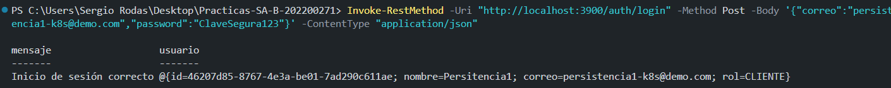

El `PersistentVolumeClaim` no se borra cuando muere el pod. Ni siquiera con
`helm uninstall`.

### 4.5 Bloqueo por NetworkPolicy

Levanté un pod suelto dentro del namespace, sin las etiquetas que las políticas
exigen, e intenté conectarlo a Postgres y a RabbitMQ.

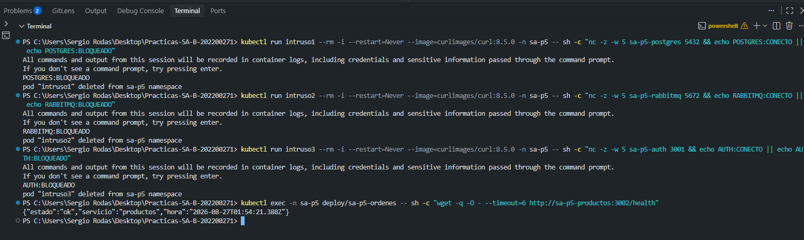

Los dos bloqueados. Y para que la evidencia sirva de algo, comprobé también que
lo permitido sigue pasando: órdenes alcanza a productos porque esa es la única
llamada lateral que autoricé.

### 4.6 Entrada por el Ingress

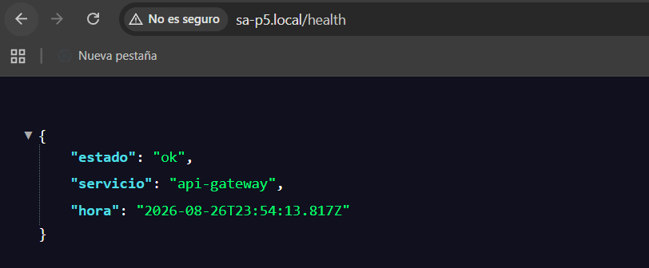

### 4.7 Flujo asíncrono sin pérdida de mensajes

Bajé notificaciones a cero réplicas y registré cuatro usuarios. Las cuatro
peticiones respondieron sin esperar a nadie.

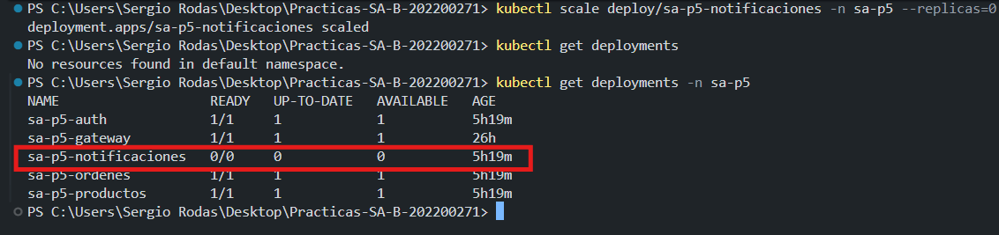

Los mensajes se acumularon en la cola, marcada como durable.

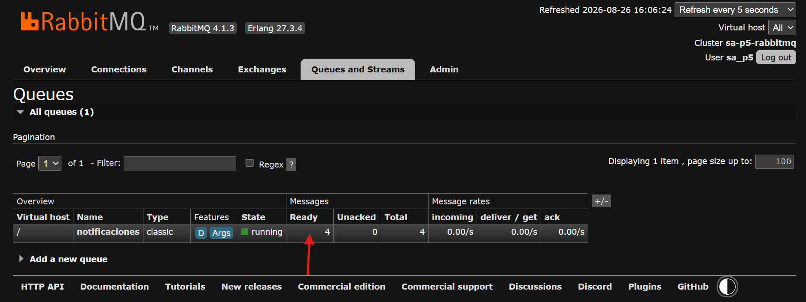

Al levantar el consumidor, la cola se vació y los cuatro quedaron guardados en
la base.

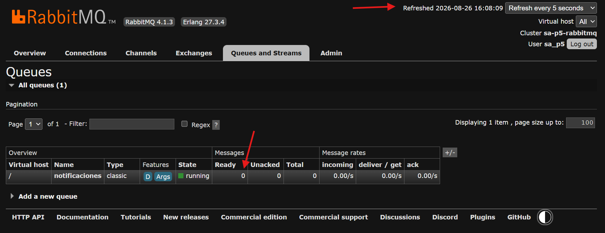

El detalle que confirma que estuvieron encolados: los cuatro se procesaron en el
mismo segundo, en ráfaga, al volver el consumidor. No cuando se registraron.

### 4.8 Cronjobs encadenados

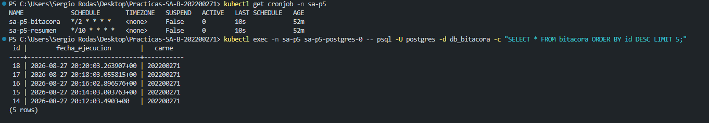

El primero inserta cada 2 minutos la fecha en GMT-6 y el carné. El segundo lee
esos registros cada 10 minutos, cuenta las ejecuciones por hora y publica el
resumen en la cola, donde notificaciones lo consume y lo guarda como cualquier
otro aviso.

---

## 5. Prueba de carga

Script en `carga/k6-carga.js`. Sube la concurrencia por escalones, de 20 a 60 y
después a 120 usuarios virtuales, para darle tiempo al HPA de reaccionar.

| Métrica | Valor |
|---|---|
| Peticiones totales | 106,853 |
| Peticiones por segundo | 508.64 RPS |
| Latencia p95 | 92.87 ms |
| Latencia promedio | 16.59 ms |
| Tasa de error | 0.00 % |
| Concurrencia máxima | 120 usuarios virtuales |

Lo corrí dentro del clúster, así no tuve que instalar k6 en Windows ni depender
del túnel:

```powershell
Get-Content P5/carga/k6-carga.js | kubectl run k6 -n default --rm -i --image=grafana/k6:0.49.0 --restart=Never -- run -
```

---

## 6. Preguntas teóricas

### ¿Qué es Helm y qué problema resuelve frente a los manifiestos sueltos?

Helm empaqueta todos los archivos YAML de una aplicación en una sola unidad
instalable y parametrizable.

Sin Helm tendría unos 50 archivos sueltos y los valores repetidos en todos
lados: el namespace, el nombre del release, los puertos. Cambiar el nombre del
proyecto significaría editar 50 archivos a mano. Con Helm escribo el valor una
vez y las plantillas lo interpolan.

Lo otro que gana es el historial. Helm sabe qué instaló y en qué orden, así que
puede desinstalarlo o revertirlo completo. Con `kubectl apply -f` cada archivo va
por su cuenta y no queda registro de qué se aplicó junto con qué.

### ¿Diferencia entre chart, release y repository?

- **Chart** es la receta: las plantillas y los valores por defecto. Un archivo en
  disco. En mi caso, `charts/sa-platform`.
- **Release** es una instalación concreta de esa receta, corriendo en un clúster.
  El mío se llama `sa-p5`. Del mismo chart podría instalar dos releases con
  nombres distintos y no chocarían.
- **Repository** es de donde se bajan charts que no escribí yo. Usé el de
  Bitnami para RabbitMQ.

La analogía que me sirvió: el chart es la receta de cocina, el release es el
plato que ya está en la mesa, el repository es el libro de recetas.

### ¿Qué es un StatefulSet y cuándo NO usarlo?

Un Deployment trata a sus pods como intercambiables: los nombra al azar y si uno
muere lo reemplaza por otro con nombre nuevo y disco nuevo. Un StatefulSet les
da nombre fijo y numerado (`postgres-0`) y un disco propio que se le vuelve a
enganchar al reemplazo.

Lo usé para Postgres y RabbitMQ. Los dos guardan algo que no se puede perder.

**Cuándo no usarlo:** cuando el componente no guarda nada. Mis cinco
microservicios son Deployments porque no importa cuál pod atiende cada petición.
Meterlos en un StatefulSet solo agregaría restricciones sin beneficio: arrancan
en orden uno por uno, más lento, y sin razón.

### ¿Diferencia entre liveness, readiness y startup probe?

- **Startup**: ¿ya terminó de arrancar? Si falla, sigue esperando. No mata nada.
  Le di 60 segundos porque NestJS tarda en levantar TypeORM.
- **Readiness**: ¿le puedo mandar tráfico? Si falla, lo sacan del Service pero
  sigue vivo. Reacciona rápido, en unos 15 segundos, porque sacarlo de rotación
  es barato y se revierte solo.
- **Liveness**: ¿sigue vivo o está colgado? Si falla, lo matan y lo reinician.
  La puse cuatro veces más lenta que la readiness, porque matar es caro.

El error típico es usar liveness donde iba readiness: terminás matando pods que
solo estaban ocupados un momento, y con eso le echás más carga a los que quedan.

### ¿Qué es una NetworkPolicy y por qué el tráfico es permitido por defecto?

Es una regla de firewall a nivel de pod: quién puede hablarle a quién.

Kubernetes permite todo por defecto por compatibilidad. Si al instalar un
clúster todo quedara bloqueado, ninguna aplicación funcionaría hasta escribir
las reglas, y la mayoría de la gente ni sabría por dónde empezar. La decisión
fue que arranque abierto y que quien necesite cerrarlo lo haga a propósito.

El detalle raro que me costó entender: un pod sin ninguna política sigue
completamente abierto, pero apenas una política lo selecciona, pasa a lo
contrario y solo se permite lo que esté autorizado. Por eso mi primera política
es un `denegar-todo` que selecciona todos los pods del namespace.

Otra cosa que aprendí con tiempo: cuando dos políticas seleccionan el mismo pod,
sus permisos se **suman**. No existe un "deny" que le gane a un "allow". El
chart de Bitnami traía su propia política que abría los puertos sin limitar el
origen, y en la práctica anulaba la mía. Tuve que apagarla.

### ¿Qué es un PodDisruptionBudget?

Es la regla de "no pueden irse todos de vacaciones el mismo día asi es mi analogia". Limita cuántos pods de un componente pueden bajarse a la vez por una interrupción voluntaria.

La palabra clave es voluntaria. Si el nodo se muere de golpe, el PDB no puede
hacer nada. 

Los míos dicen `minAvailable: 1`. Con una sola réplica eso deja las
interrupciones permitidas en cero, que es correcto aunque parezca inútil: si
saco el único pod, quedan cero y el mínimo exige uno. Cuando el HPA escala a
tres, ese mismo PDB pasa a permitir dos y ahí sí protege de verdad.

### ¿Qué ventajas y qué nuevos problemas introduce la comunicación asíncrona?

**La ventaja la viví.** Con notificaciones apagado, registré cuatro usuarios y
las cuatro peticiones respondieron normal. Antes, con HTTP directo, si
notificaciones se caía el registro fallaba o se colgaba. Ahora Auth deja el
mensaje en la cola y sigue. Un componente caído deja de arrastrar a los demás.

**Los problemas nuevos también los viví.** El principal es que ya no hay
respuesta inmediata. Cuando publico un mensaje no sé si se procesó, solo sé que
se entregó. Para averiguarlo tengo que ir a mirar la cola o la base. Me pasó
literal mientras probaba: la interfaz de RabbitMQ mostraba cero mensajes y yo
pensaba que algo estaba roto, cuando en realidad la página estaba desconectada y
mostrando datos viejos. En un sistema síncrono el error habría sido evidente al
instante.

### ¿Qué hace `helm rollback` internamente?

Helm guarda cada revisión completa dentro del propio clúster, como un Secret en
el namespace del release. No guarda solo el cambio: guarda el manifiesto entero
que aplicó esa vez.

`helm rollback sa-p5 19` va a buscar el manifiesto de la revisión 19, lo compara
con lo que está corriendo ahora y aplica las diferencias. Después crea una
revisión **nueva** con ese contenido, que en mi caso fue la 21.

Eso último es lo que más me llamó la atención: no borra el historial ni retrocede
el contador. La revisión 20, la rota, sigue ahí registrada. El historial es
siempre hacia adelante, y por eso se puede hacer rollback de un rollback.
