<p align="left">
Universidad San Carlos de Guatemala<br>
Facultad de Ingeniería<br>
Ingeniería en ciencias y sistemas<br>
Laboratorio de Software Avanzado

Nombre: Sergio Joel Rodas Valdez<br>
Carné: 202200271
</p>

# Práctica 6 - Despliegue en un clúster de Kubernetes en la nube

## Qué hice

Agarré la plataforma completa de mi práctica 5, sin cambiarle una línea de código, y
la desplegué en un clúster de Kubernetes administrado: GKE (Google Kubernetes
Engine), en `us-central1-a`. Mismo chart de Helm, mismos microservicios, mismo
broker, misma base de datos.

Lo que sí cambió:

- Las 7 imágenes propias (5 microservicios y 2 cronjobs) ahora salen de Artifact Registry, no de mi máquina.
- Postgres y RabbitMQ usan la StorageClass `standard-rwo` de GCP, discos de verdad y no el volumen simulado de minikube.
- El Ingress tiene una IP pública fija, `34.59.174.240`, sin `minikube tunnel` de por medio.
- Las credenciales siguen fuera del repo con el mismo mecanismo de la P5: `values.secretos.yaml` está en `.gitignore` y el chart falla si falta.

## Dirección pública

```
http://34.59.174.240.nip.io
```

No compré dominio. `nip.io` resuelve cualquier `IP.nip.io` a esa misma IP, así que me
da un hostname real para el Ingress (que exige un `host`) sin pagar nada.

Prueba rápida desde cualquier red:

```
http://34.59.174.240.nip.io/health
```

---

## Lo que tuve que adaptar

El chart de la P5 no se tocó. Todo el cambio vive en un solo archivo,
[`values-cloud.yaml`](values-cloud.yaml), que se aplica encima:

| Qué | En minikube - P5 | En GKE - P6 |
|---|---|---|
| Origen de las imágenes | `p4-gateway:1.1.0` cargada con `minikube image load` | `us-central1-docker.pkg.dev/sa-p6-202200271/sa-p6/p4-gateway:1.1.0` |
| Política de descarga | `Never` | `IfNotPresent` |
| StorageClass | vacía (la de minikube por defecto) | `standard-rwo` |
| Host del Ingress | `sa-p5.local` en el archivo hosts | `34.59.174.240.nip.io` |
| Requests de CPU | 50m por servicio | 15m, y el umbral del HPA subido a 70% |

El último renglón es el que más me costó entender. Con requests de 15m, un HPA al 30%
dispararía con 4.5m de uso, o sea por nada. Lo subí a 70% para que escale cuando de
verdad haya carga.

Lo que no cambió: NetworkPolicies, RBAC, `securityContext`, PodDisruptionBudgets,
ResourceQuota, LimitRange y los dos cronjobs. Todo eso funciona igual en la nube.

---

## Cómo lo reproduzco desde cero

### 1. Proyecto y APIs

```powershell
gcloud auth login
gcloud projects create sa-p6-202200271
gcloud config set project sa-p6-202200271
gcloud services enable container.googleapis.com artifactregistry.googleapis.com
```

### 2. Registro de contenedores

```powershell
gcloud artifacts repositories create sa-p6 --repository-format=docker --location=us-central1
gcloud auth configure-docker us-central1-docker.pkg.dev
```

Reetiquetar y subir las 7 imágenes que ya existían de la P5. No las reconstruí:

```powershell
docker tag p4-gateway:1.1.0        us-central1-docker.pkg.dev/sa-p6-202200271/sa-p6/p4-gateway:1.1.0
docker tag p4-auth:1.1.0           us-central1-docker.pkg.dev/sa-p6-202200271/sa-p6/p4-auth:1.1.0
docker tag p4-productos:1.1.0      us-central1-docker.pkg.dev/sa-p6-202200271/sa-p6/p4-productos:1.1.0
docker tag p4-ordenes:1.1.0        us-central1-docker.pkg.dev/sa-p6-202200271/sa-p6/p4-ordenes:1.1.0
docker tag p4-notificaciones:1.2.0 us-central1-docker.pkg.dev/sa-p6-202200271/sa-p6/p4-notificaciones:1.2.0
docker tag p5-cron-bitacora:1.0.1  us-central1-docker.pkg.dev/sa-p6-202200271/sa-p6/p5-cron-bitacora:1.0.1
docker tag p5-cron-resumen:1.0.0   us-central1-docker.pkg.dev/sa-p6-202200271/sa-p6/p5-cron-resumen:1.0.0

docker push us-central1-docker.pkg.dev/sa-p6-202200271/sa-p6/p4-gateway:1.1.0
docker push us-central1-docker.pkg.dev/sa-p6-202200271/sa-p6/p4-auth:1.1.0
docker push us-central1-docker.pkg.dev/sa-p6-202200271/sa-p6/p4-productos:1.1.0
docker push us-central1-docker.pkg.dev/sa-p6-202200271/sa-p6/p4-ordenes:1.1.0
docker push us-central1-docker.pkg.dev/sa-p6-202200271/sa-p6/p4-notificaciones:1.2.0
docker push us-central1-docker.pkg.dev/sa-p6-202200271/sa-p6/p5-cron-bitacora:1.0.1
docker push us-central1-docker.pkg.dev/sa-p6-202200271/sa-p6/p5-cron-resumen:1.0.0
```

RabbitMQ y Postgres no los subí. Sus imágenes ya son públicas en Docker Hub y los
nodos las bajan solos.

### 3. Clúster

```powershell
gcloud container clusters create sa-p6 --zone=us-central1-a --num-nodes=3 --machine-type=e2-medium --enable-dataplane-v2
```

Zonal y no regional: un clúster regional levanta 3 réplicas del control plane y sí
cobra. El zonal tiene el control plane gratis.

`--enable-dataplane-v2` es el equivalente en GKE del `--cni=calico` que usé en
minikube. Sin eso las NetworkPolicies de la P5 se crean pero no bloquean nada.

Conectar `kubectl` al contexto remoto:

```powershell
gcloud container clusters get-credentials sa-p6 --zone=us-central1-a
kubectl config current-context
kubectl get nodes
```

### 4. Ingress Controller

```powershell
helm repo add ingress-nginx https://kubernetes.github.io/ingress-nginx
helm install ingress-nginx ingress-nginx/ingress-nginx --namespace ingress-nginx --create-namespace
```

Lo instalé en el namespace `ingress-nginx` porque es el nombre que ya esperan las
NetworkPolicies de la P5. Cero cambios de ese lado.

GKE le asigna una IP pública real a su Service. Con esa IP armé el host:

```powershell
kubectl get svc -n ingress-nginx
```

### 5. Desplegar

Mismo chart de la P5, con el overlay encima solo hice eso:

```powershell
helm dependency update ./P5/charts/sa-platform

helm lint ./P5/charts/sa-platform -f ./P5/charts/sa-platform/values-dev.yaml -f ./P6/values-cloud.yaml -f ./P5/charts/sa-platform/values.secretos.yaml

helm install sa-p6 ./P5/charts/sa-platform -f ./P5/charts/sa-platform/values-dev.yaml -f ./P6/values-cloud.yaml -f ./P5/charts/sa-platform/values.secretos.yaml
```

### 6. Verificar

```powershell
kubectl get pods -n sa-p5
kubectl get pvc -n sa-p5
Invoke-RestMethod -Uri "http://34.59.174.240.nip.io/health"
```

---

## Evidencias

### 1. El clúster en la consola de GCP

`sa-p6` en `us-central1-a`, 3 nodos, 6 vCPU, 12 GB, al 100% en buen estado.

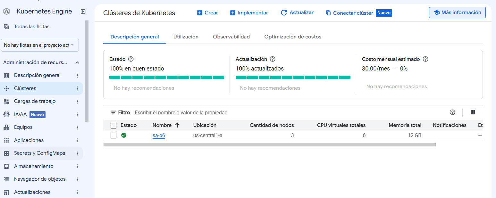

### 2. Detalle del clúster

Modo Standard y tipo de ubicación Zonal, que es la condición para no pagar el control
plane.

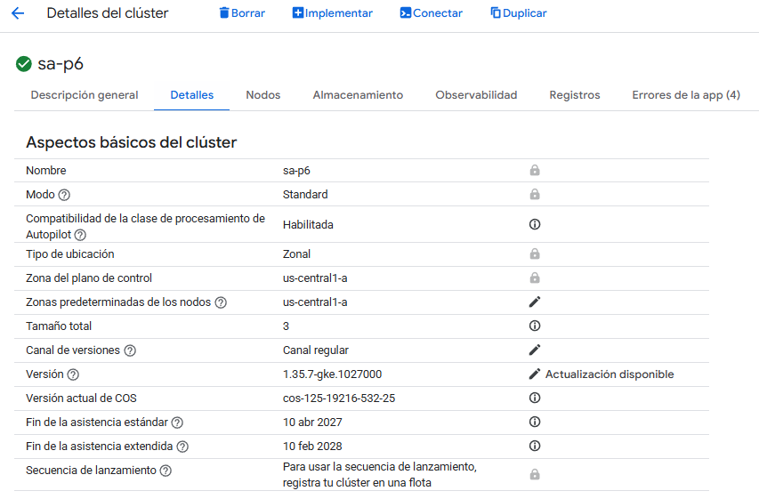

### 3. Los nodos

El `default-pool` con sus 3 nodos `e2-medium`, los tres en `Ready`.

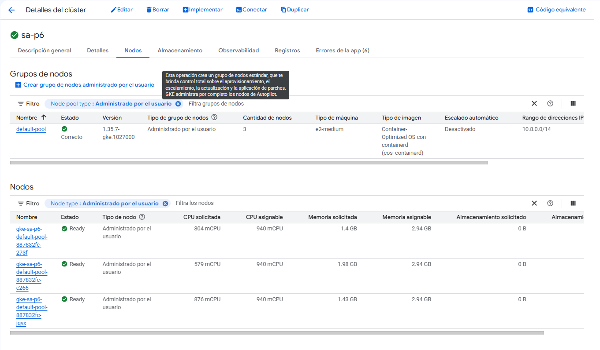

### 4. kubectl apuntando al clúster remoto

El contexto es `gke_sa-p6-202200271_us-central1-a_sa-p6`, no minikube.

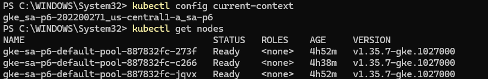

### 5. Imágenes en Artifact Registry

Las 7 imágenes propias publicadas en el repositorio `sa-p6`.

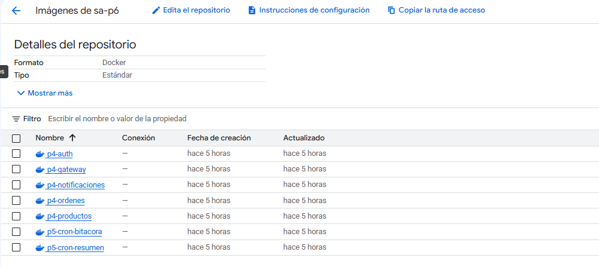

### 6. Los pods corriendo

Los 5 microservicios, Postgres, RabbitMQ y los cronjobs disparando solos, todos en el
namespace `sa-p5`. Ningún `ImagePullBackOff`, así que el clúster está bajando las
imágenes del registro sin problema.

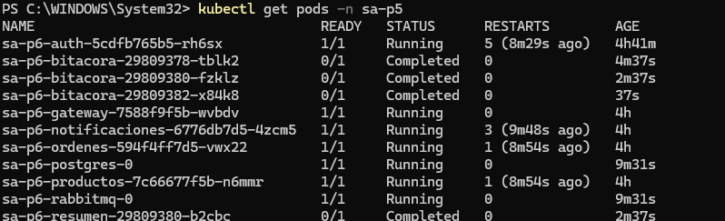

### 7. Almacenamiento con la StorageClass del proveedor

Los dos PVC (Postgres y RabbitMQ) en `Bound` con `standard-rwo`, el disco persistente
de GCP.

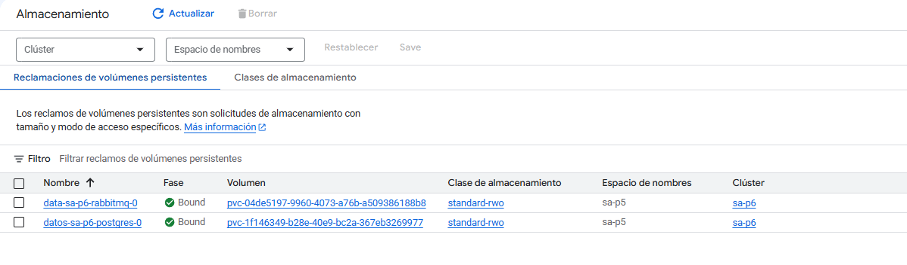

### 8. Secrets y ConfigMaps

Un Secret por componente, generados por Helm desde `values.secretos.yaml`. Ese
archivo nunca se subió al repositorio.

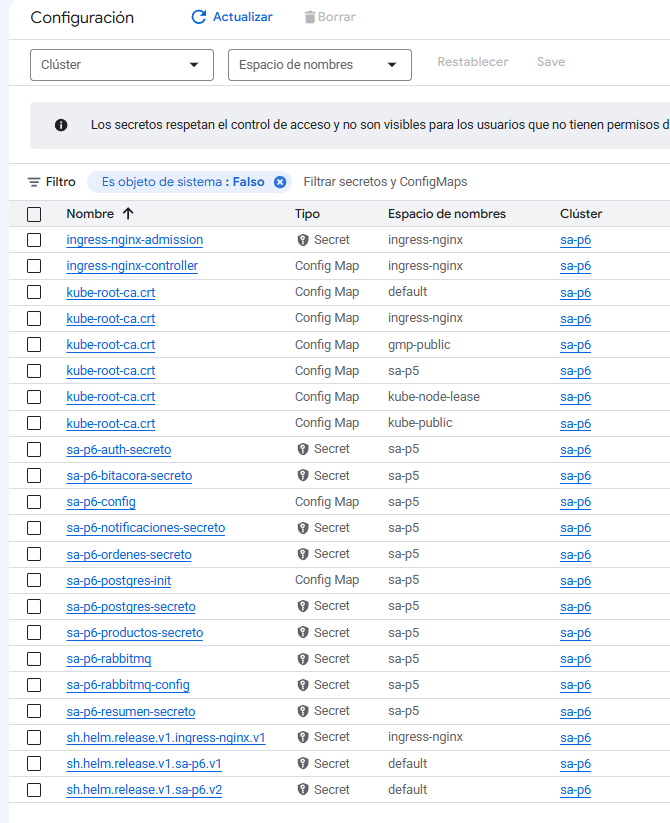

### 9. El Ingress

`sa-p6-ingress` en estado OK, con el frontend `34.59.174.240.nip.io` apuntando al
Service del gateway.

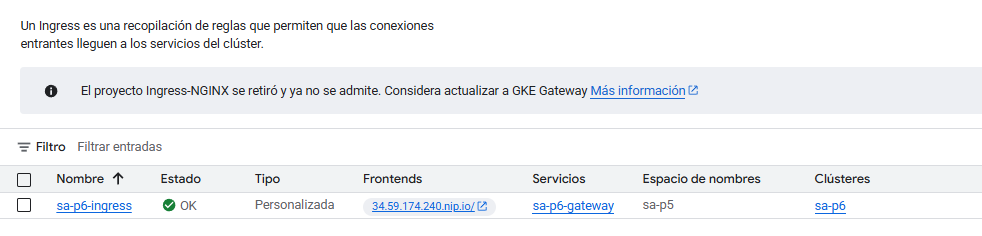

### 10. Detalle del Ingress

La IP pública `34.59.174.240` y el pod que está atendiendo, 1/1 en `Running`.

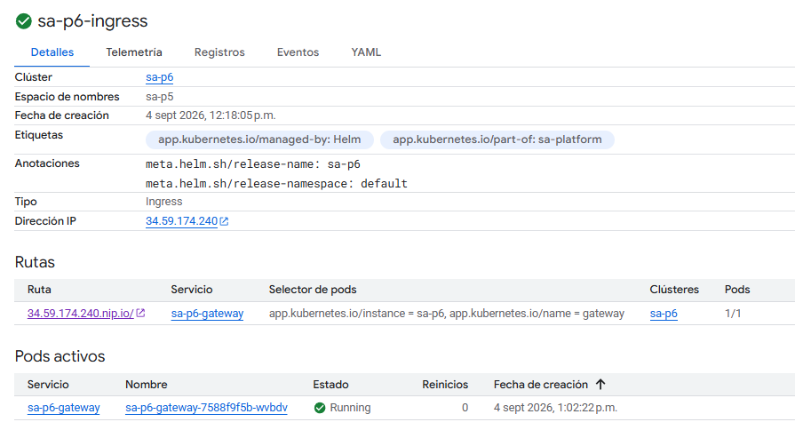

### 11. Petición desde el navegador

`/health` respondiendo desde internet contra la dirección pública.

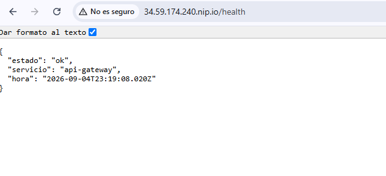

### 12. Petición desde Postman

Un `POST /auth/register` contra la misma dirección pública, con respuesta
`201 Created` y el usuario creado. El sistema no solo responde, escribe en la base de
datos.

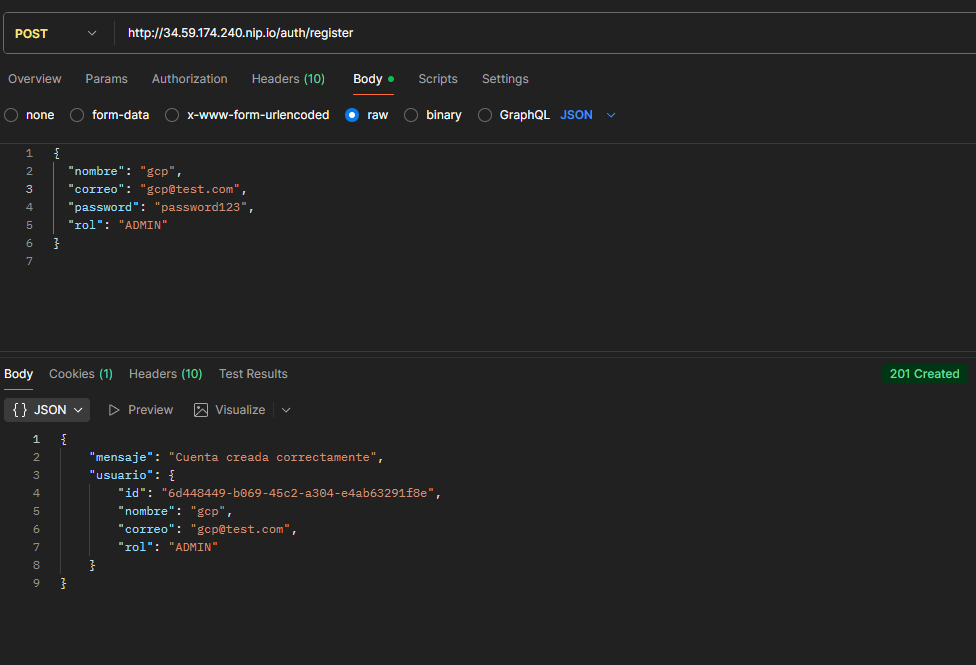

### 13. Reporte de facturación

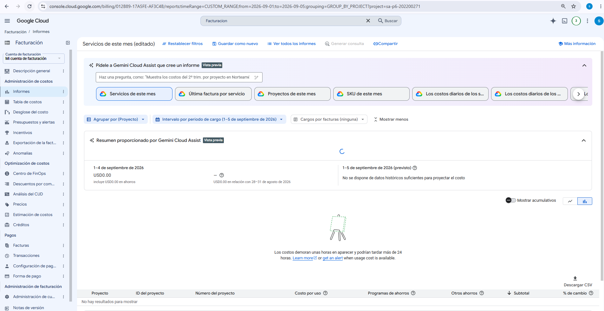

---

## Costo aproximado

| Recurso | Cantidad | Tarifa oficial (us-central1) | Tiempo facturado | Subtotal |
|---|---|---|---|---|
| VM `e2-medium` (cómputo) | 3 nodos | $0.03357 / hora c/u | ~5.6 h | ~$0.56 |
| Disco de arranque `pd-balanced` 30 GB | 3 discos | $0.10 / GB-mes | ~6 h | ~$0.07 |
| Disco de datos `pd-balanced` 1 GB | 2 discos (Postgres, RabbitMQ) | $0.10 / GB-mes | ~6 h | ~$0.001 |
| IP pública / Load Balancer del Ingress | 1 regla de reenvío | $0.025 / hora | ~6 h | ~$0.15 |
| Control plane (clúster zonal Standard) | 1 | Gratis | | $0.00 |
| **Total estimado** | | | | **~$0.79 USD** |

El reporte de facturación todavía marca USD 0.00 porque Google tarda hasta 24 horas
en publicar el consumo, y la propia consola lo advierte. Por eso la tabla va con las
tarifas oficiales de GCP y el tiempo real que estuvo encendido cada recurso.

Un detalle que separé a propósito: el disco y el cómputo no se cobran igual. Cuando
una VM queda apagada, Google deja de cobrar CPU y memoria, pero el disco sigue
costando porque los datos siguen ocupando espacio. Por eso el tiempo facturado del
disco es todo el transcurrido y el del cómputo no.


---

## Cómo elimino los recursos

Mientras tenga que mostrar el sistema funcionando, apago el cómputo sin borrar nada.
Escalar el node pool a 0 apaga las 3 VMs, que son las que cobran por hora, y deja
intactos el clúster, el release de Helm y los datos de los PVC:

```powershell
gcloud container clusters resize sa-p6 --node-pool=default-pool --num-nodes=0 --zone=us-central1-a
```

Para levantarlo otra vez, el mismo comando con `--num-nodes=3`. No hay que reinstalar
nada con Helm, todo vuelve como estaba.

Cuando ya no necesite mostrar nada, la baja definitiva solo tengo que hacer:

```powershell
# 1. Quitar la plataforma
helm uninstall sa-p6

# 2. Los PVC no se borran con el uninstall, hay que borrarlos aparte
kubectl delete pvc --all -n sa-p5

# 3. El Ingress Controller, que es quien sostiene la IP pública
helm uninstall ingress-nginx -n ingress-nginx

# 4. El clúster completo (se lleva las 3 VMs y sus discos)
gcloud container clusters delete sa-p6 --zone=us-central1-a

# 5. El registro con las 7 imágenes
gcloud artifacts repositories delete sa-p6 --location=us-central1

# 6. El proyecto entero, para que no quede nada cobrando
gcloud projects delete sa-p6-202200271
```

El orden importa. Si borro el clúster antes de eliminar el Ingress Controller, la
regla de reenvío del balanceador puede quedar huérfana en la cuenta y seguir
cobrando.

---

## Preguntas

### 1. ¿Qué es un clúster de Kubernetes administrado y qué diferencias tiene frente a uno local?

Es un clúster donde el proveedor se encarga del control plane y yo solo pongo las
cargas de trabajo. En GKE nunca vi la máquina donde corre el API server, etcd, el
scheduler ni los controladores. Google los tiene, los respalda y los actualiza. En
minikube todo eso vivía en una VM en mi laptop y si la apagaba, se apagaba el clúster
entero.

Las diferencias que me tocaron en la práctica:

El almacenamiento. En minikube el PVC se resolvía con una carpeta del host. Acá pedí
`standard-rwo` y GCP creó dos discos persistentes de verdad, que existen aunque el pod
y hasta el nodo desaparezcan.

El balanceo. En minikube el Service de tipo LoadBalancer se quedaba en `Pending` para
siempre a menos que corriera `minikube tunnel`, y eso solo funcionaba en mi máquina.
En GKE me dieron una IP pública enrutable desde cualquier parte.

Las identidades. Local no existe el concepto. Acá hay dos sistemas de permisos
distintos que conviven: IAM, que dice qué puedo hacer con recursos de GCP, y el RBAC
de Kubernetes, que dice qué puedo hacer dentro del clúster. Ser dueño del proyecto no
me daba permiso para ver los pods desde la consola web hasta que me agregué un
ClusterRoleBinding.

El costo. Local no cobra. Acá cada hora de nodo encendido se paga.

Y una diferencia que no esperaba: a mitad de la práctica las 3 VMs aparecieron
apagadas. Revisando `gcloud compute operations list` descubrí que las paró un servicio
interno de Google, el sistema automático que vigila cuentas nuevas en modo prueba
gratuita. Lo resolví pasando la facturación a cuenta pagada y arrancando las VMs. Lo
interesante fue lo que pasó después: al volver los nodos, Kubernetes reprogramó los 7
componentes solo, sin que yo reinstalara nada con Helm, y los datos de Postgres
seguían ahí porque vivían en el disco persistente y no en el nodo.

### 2. ¿Qué es un Service de tipo LoadBalancer y cómo lo implementa el proveedor de nube?

Es un Service que, además de darle una IP interna al conjunto de pods, le pide al
proveedor de nube una IP pública. En el manifiesto solo escribo `type: LoadBalancer`,
sin decir cómo.

Quien lo traduce es el cloud controller manager, un componente que corre dentro del
control plane de GKE y está mirando la API de Kubernetes. Cuando aparece un Service de
ese tipo, llama a la API de Google Cloud y crea un balanceador de red: una regla de
reenvío con una IP pública, un pool con los nodos del clúster como destino y health
checks para sacar del pool al que no responda. Cuando el balanceador ya está listo,
escribe la IP de vuelta en el campo `status.loadBalancer` del Service, y por eso
`kubectl get svc` pasa de `<pending>` a mostrar la IP.

En mi caso el Service de tipo LoadBalancer no es el de un microservicio, es el del
Ingress Controller. Esa es la única puerta de entrada: recibe todo en
`34.59.174.240` y el Ingress decide, según la ruta, a qué Service interno mandarlo. El
gateway y el resto siguen siendo ClusterIP, sin exposición directa.

### 3. ¿Qué es un registro de contenedores y por qué es necesario para desplegar en la nube?

Es un servidor que guarda imágenes de Docker y las entrega cuando alguien las pide por
nombre y etiqueta, con autenticación de por medio. Docker Hub es el público más
conocido, Artifact Registry es el de Google.

Es necesario porque los nodos que ejecutan mis contenedores son 3 VMs de Google en
us-central1, no mi computadora. En la P5 podía usar `minikube image load` para meterle
la imagen al nodo a mano y poner `politicaDescarga: Never`, porque el nodo era mi
propia máquina y la imagen ya estaba ahí. En GKE eso no tiene equivalente: no tengo
cómo copiarle un archivo a cada nodo, y menos si el autoescalado crea uno nuevo
mañana.

Entonces cada nodo tiene que poder bajarse la imagen solo, y para eso necesita una
dirección de donde bajarla. Por eso subí las 7 imágenes propias a Artifact Registry y
cambié la política a `IfNotPresent`, que baja la imagen si el nodo todavía no la
tiene. Postgres y RabbitMQ no los subí porque sus imágenes ya son públicas en Docker
Hub.

### 4. ¿Qué componentes del clúster administra el proveedor y cuáles siguen siendo responsabilidad del estudiante?

Google administra el control plane completo (API server, etcd, scheduler y
controladores) con sus respaldos y actualizaciones, el sistema operativo y el kubelet
de los nodos, el driver CSI que convierte un PVC en un disco real, el cloud controller
que convierte un Service de tipo LoadBalancer en un balanceador, y toda la
infraestructura física y de red por debajo.

Lo mío es todo lo que va adentro: el chart de Helm y sus manifiestos, qué versión de
cada imagen se despliega, los requests y limits de cada contenedor, las
NetworkPolicies, el RBAC, los securityContext, los Secrets y de dónde salen, y los
respaldos de los datos de mi Postgres. Google guarda el disco pero no me hace un dump
de la base.

Y la cuenta. GKE no me impide desplegar algo inseguro ni algo caro. Si dejo 3 nodos
encendidos un mes, me los cobra sin avisar.

### 5. ¿Qué costos genera el despliegue realizado y cómo podrían reducirse?

Los de la tabla de más arriba, alrededor de $0.79 por las horas que estuvo encendido.
Lo que cobra es el cómputo de los nodos, los discos y la regla de reenvío del
balanceador. El control plane no cobra por ser un clúster zonal.

Las formas de bajarlo, de la que más ahorra a la que menos:

Apagar el cómputo cuando no se usa, escalando el node pool a 0. Los nodos son el 70%
de la factura y ese comando los apaga sin destruir nada.

Bajar el número de nodos. Con 3 cubrí el mínimo de 2 que pide la rúbrica y me sobró
uno. La plataforma entera cabe en 2.

Usar un tipo de máquina más chico. Con los requests que dejé en `values-cloud.yaml`
(15m de CPU por servicio), un `e2-small` alcanza y cuesta la mitad.

Borrar el Ingress Controller cuando no hay que demostrar nada. Mientras exista, la
regla de reenvío cobra por hora aunque nadie haga peticiones.

Poner una alerta de presupuesto en la cuenta de facturación. No baja el costo, pero
avisa antes de que se vuelva un problema.
