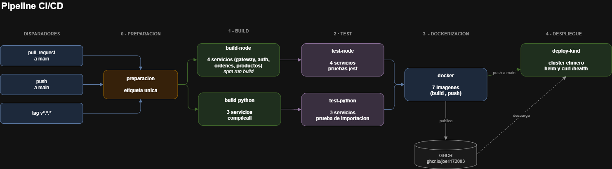

Universidad San Carlos de Guatemala 
Facultad de Ingeniería 
Ingeniería en ciencias y sistemas 
Laboratorio de Software Avanzado

Nombre: Sergio Joel Rodas Valdez 
Carné: 202200271

# Práctica 7 - Integración y Despliegue Continuo (CI/CD)

Todo el ciclo que en la Practica 5 y la Practica 6 hice a mano (compilar, probar, construir
imágenes, desplegar) ahora corre solo con cada commit. El pipeline vive en
[`.github/workflows/ci-cd.yml`](../.github/workflows/ci-cd.yml).

## Qué dispara qué

No todo corre siempre. El evento decide hasta dónde llega el pipeline:

| Evento | Build | Test | Imágenes | Despliegue |
|---|:--:|:--:|:--:|:--:|
| Pull request a `main` | sí | sí | no | no |
| Push a `main` | sí | sí | sí | kind |
| Tag `v*.*.*` | sí | sí | sí |  |

Un Pull Request se valida pero no publica nada. Esa es la diferencia que evita
ensuciar el registro con imágenes de código que todavía nadie revisó.

## Etapa 0: preparación

Calcula una sola etiqueta para toda la corrida y la deja disponible para los
demás jobs. Si viene de un tag `v1.0.0` usa `1.0.0`; si no, usa `sha-` más
los primeros 7 caracteres del commit.

Sin este paso, el job que construye la imagen y el que la despliega podrían
calcular etiquetas distintas, y el clúster terminaría pidiendo una imagen que
nunca existió.

## Etapa 1: build

Dos caminos en paralelo, porque los dos lenguajes se validan distinto.

`build-node` corre sobre los 4 servicios de NestJS a la vez, cada uno en su
propia máquina: `npm ci` y `npm run build`. Compila el TypeScript.

`build-python` valida la sintaxis de los 3 servicios de Python con
`compileall`. No los ejecuta: esos módulos leen variables de entorno al
importarse y sin base de datos ni broker reventarían con un `KeyError`.

## Etapa 2: test

`test-node` corre las pruebas de jest de los 4 servicios. Cubren la política
de renovación del JWT, el guard de sesión del gateway, el apartado de stock
de productos y la compensación de la saga de órdenes.

Cada test espera a su build. No tiene sentido probar código que ni compila.

## Etapa 3: dockerización

7 líneas en paralelo, una por imagen. Cada una construye desde su propia
carpeta y publica en Git hub Container Registry (GHCR) con varias etiquetas a la vez: la del commit,
`latest`, y las de versión si el disparador fue un tag.

Todas las etiquetas apuntan a la misma imagen. El despliegue usa la del
commit, que no cambia nunca; `latest` queda solo como comodidad.

## Etapa 4: despliegue

`deploy-kind` levanta un clúster de Kubernetes desechable dentro del propio
runner, instala el Ingress Controller, baja las 7 imágenes de GHCR y las
carga al nodo, y las despliega con el mismo chart de Helm de la Practica 5. Al
terminar el job, el clúster se destruye.

La prueba final no es que los pods arranquen: es un `curl` al `/health` del
gateway entrando por el Ingress. Si responde `{"estado":"ok"}`, el despliegue
sirvió de verdad.

Este job no usa ningún secreto. Las credenciales del clúster desechable se
generan al vuelo con `openssl`, así que no puede fallar por configuración
faltante.

`deploy-gke` apunta al clúster real de la Practica 6 y corre solo con un tag de
versión o desde el botón manual. Quedó configurado pero sin ejecutar: la
cuenta de Google que administra mi proyecto fue suspendida durante el
desarrollo de la práctica, y la apelación sigue en revisión.

## Archivos

| Archivo | Qué es |
|---|---|
| [`.github/workflows/ci-cd.yml`](../.github/workflows/ci-cd.yml) | El pipeline completo |
| [`values-kind.yaml`](values-kind.yaml) | Valores de Helm para el clúster efímero |
| [`values-gke.yaml`](values-gke.yaml) | Valores de Helm para el GKE de la Practica 6 |
| [`kind/kind-config.yaml`](kind/kind-config.yaml) | Clúster de un nodo con el puerto 80 abierto |
