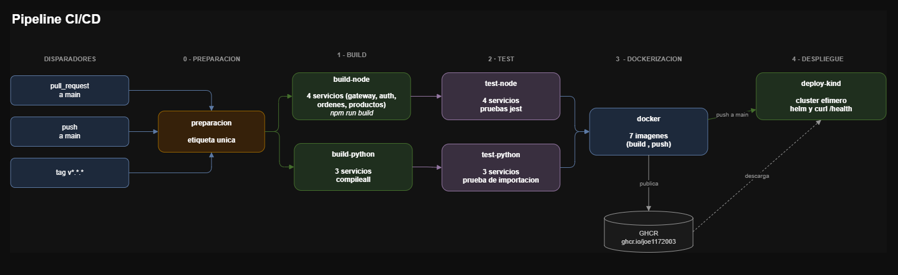
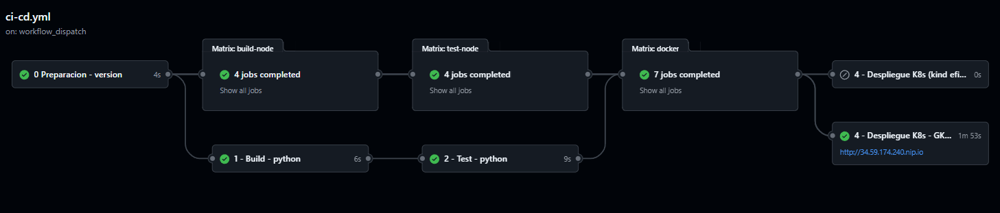
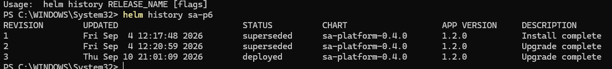
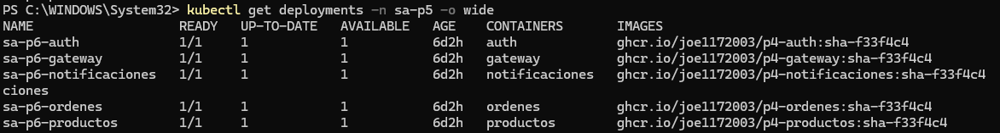

Universidad San Carlos de Guatemala 
Facultad de Ingeniería 
Ingeniería en ciencias y sistemas 
Laboratorio de Software Avanzado

Nombre: Sergio Joel Rodas Valdez 
Carné: 202200271

# Práctica 7 - Integración y Despliegue Continuo (CI/CD)

Todo el ciclo que en la Practica 5 y la Practica 6 hice a mano (compilar, probar, construir
imágenes, desplegar) ahora corre solo con cada commit. El pipeline vive en
[`.github/workflows/ci-cd.yml`](../.github/workflows/ci-cd.yml).

# Evidencia de ejecución - pipeline 

## Qué dispara qué

No todo corre siempre. El evento decide hasta dónde llega el pipeline:

| Evento | Build | Test | Imágenes | Despliegue |
|---|:--:|:--:|:--:|:--:|
| Pull request a `main` | sí | sí | no | no |
| Push a `main` | sí | sí | sí, con `sha-` | kind |
| Tag `v1.*.*` | sí | sí | sí, con la versión | kind |
| Botón *Run workflow* | sí | sí | sí | kind |

Un Pull Request se valida pero no publica nada. Esa es la diferencia que evita
ensuciar el registro con imágenes de código que todavía nadie revisó.

Los tags de esta práctica son la serie 1. El repositorio lo comparto con la
Práctica 8, que publica la serie 2: si esta escuchara cualquier `v*`, un tag
de la P8 la despertaría y volvería a subir la misma versión con otro digest,
pisando la imagen que la P8 firmó.

## Etapa 0: preparación

Calcula una sola etiqueta para toda la corrida y la deja disponible para los
demás jobs. Si viene de un tag `v1.0.0` usa `1.0.0`; si no, usa `sha-` más
los primeros 7 caracteres del commit.

Sin este paso, el job que construye la imagen y el que la despliega podrían
calcular etiquetas distintas, y el clúster terminaría pidiendo una imagen que
nunca existió.

## Etapa 1: build

Dos caminos en paralelo, porque los dos lenguajes se validan distinto.

`build-node` corre sobre los 4 servicios de NestJS a la vez, cada uno en su
propia máquina: `npm ci` y `npm run build`. Compila el TypeScript.

`build-python` valida la sintaxis de los 3 servicios de Python con
`compileall`. No los ejecuta: esos módulos leen variables de entorno al
importarse y sin base de datos ni broker reventarían con un `KeyError`.

## Etapa 2: test

`test-node` corre las pruebas de jest de los 4 servicios. Cubren la política
de renovación del JWT, el guard de sesión del gateway, el apartado de stock
de productos y la compensación de la saga de órdenes.

Cada test espera a su build. No tiene sentido probar código que ni compila.

## Etapa 3: dockerización

7 líneas en paralelo, una por imagen. Cada una construye desde su propia
carpeta y publica en GitHub Container Registry (GHCR). Con un push a `main` la
etiqueta es la del commit; con un tag, la versión completa y la corta (`1.0.1`
y `1.0`).

No publico `latest`. Es una etiqueta que cambia de imagen cada vez, y con ella
no hay forma de saber qué código está corriendo.

## Etapa 4: despliegue

`deploy-kind` levanta un clúster de Kubernetes desechable dentro del propio
runner, instala el Ingress Controller, baja las 7 imágenes de GHCR y las
carga al nodo, y las despliega con el mismo chart de Helm de la Practica 5. Al
terminar el job, el clúster se destruye.

La prueba final no es que los pods arranquen: es un `curl` al `/health` del
gateway entrando por el Ingress. Si responde `{"estado":"ok"}`, el despliegue
sirvió de verdad.

Este job no usa ningún secreto. Las credenciales del clúster desechable se
generan al vuelo con `openssl`, así que no puede fallar por configuración
faltante.

Uso `helm install` y `kubectl create`, no `upgrade` ni `apply`: el clúster
nace vacío en cada corrida, así que no hay nada que actualizar.

## El despliegue a GKE que retiré

El pipeline tuvo un segundo destino: el clúster GKE de la Practica 6. Con un
tag, se autenticaba en GCP con la llave de una service account de rol
`roles/container.admin` y hacía `helm upgrade` sobre el release `sa-p6`.
Funcionó, y la evidencia está abajo.

Lo saqué al empezar la Práctica 8, porque ese diseño tenía un problema de
fondo: el pipeline guardaba una llave de administrador del clúster real.
Cualquiera que comprometiera el repositorio tenía el clúster. Borré el job, los
dos secretos (`GCP_SA_KEY` y `HELM_VALUES_SECRETOS`) y la llave de la service
account. En la P8 ningún workflow toca un clúster: el pipeline solo propone la
nueva versión y ArgoCD es el único que la aplica.

## Credenciales

El workflow no usa ningún secreto del repositorio. Publicar en GHCR usa el
`GITHUB_TOKEN` que GitHub genera en cada corrida, y kind genera sus propias
credenciales al vuelo.

## Evidencia del despliegue en GKE

Antes de retirarlo, el historial del release mostraba quién desplegó cada
versión. Las revisiones 1 y 2 las hice a mano en la P6; la 3 la hizo el
pipeline:

La etiqueta `sha-f33f4c4` es el commit que disparó la corrida, así que se
puede rastrear qué código exacto está en producción. Postgres y RabbitMQ no
se reiniciaron durante el upgrade: Kubernetes solo reemplazó los pods cuya
imagen cambió.

## Archivos

| Archivo | Qué es |
|---|---|
| [`.github/workflows/ci-cd.yml`](../.github/workflows/ci-cd.yml) | El pipeline completo |
| [`values-kind.yaml`](values-kind.yaml) | Valores de Helm para el clúster efímero |
| [`values-gke.yaml`](values-gke.yaml) | Valores que usaba el despliegue a GKE retirado; queda como registro |
| [`kind/kind-config.yaml`](kind/kind-config.yaml) | Clúster de un nodo con el puerto 80 abierto |
