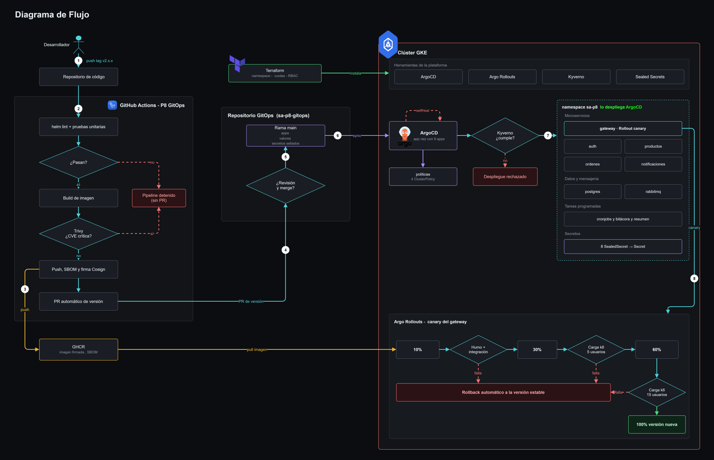

Universidad San Carlos de Guatemala 
Facultad de Ingeniería 
Ingeniería en ciencias y sistemas 
Laboratorio de Software Avanzado

Nombre: Sergio Joel Rodas Valdez 
Carné: 202200271

# Práctica 8 - GitOps, entrega progresiva y cadena de suministro

En la Práctica 7 mi pipeline tenía acceso al clúster y desplegaba solo. Si alguien comprometía el repositorio, comprometía también la infraestructura, y un commit con un error llegaba de golpe al 100% de los usuarios. En esta práctica le quité ese poder. El pipeline construye, analiza y firma las imágenes, y lo único que hace hacia afuera es abrir un Pull Request en otro repositorio. Quien aplica los cambios en el clúster es ArgoCD, y lo hace leyendo Git.

## Tabla de enlaces

| # | Qué se pide | Enlace |
|---|---|---|
| 1 | Repositorio GitOps | https://github.com/Joe1172003/sa-p8-gitops |
| 2 | Aplicación en ArgoCD | `raiz` en el namespace `argocd`. Despliega 9 apps en `sa-p8` |
| 3 | Ejecución exitosa del pipeline | https://github.com/Joe1172003/Practicas-SA-B-202200271/actions/runs/34905815907 |
| 4 | Reversión automática | Run: https://github.com/Joe1172003/Practicas-SA-B-202200271/actions/runs/34997215851 Rollout: `gateway` en `sa-p8`, AnalysisRun `gateway-576476b548-3-3` Evidencia: [fallo-inducido-2.3.0.txt](evidencias/rollouts/fallo-inducido-2.3.0.txt) |
| 5 | Despliegue rechazado por política | [rechazos-enforce.txt](evidencias/politicas/rechazos-enforce.txt) |
| 6 | Bloqueo por vulnerabilidad crítica | https://github.com/Joe1172003/Practicas-SA-B-202200271/pull/3 |
| 7 | Imagen firmada | `ghcr.io/joe1172003/p4-gateway:2.2.0` |
| 8 | Reporte de prueba de carga | [P8/evidencias/rollouts/reporte-pruebas-canary-2.2.0.txt](evidencias/rollouts/reporte-pruebas-canary-2.2.0.txt) |
| 9 | Video demostrativo | PENDIENTE: URL del video |

## Diagrama del flujo

## Cómo viaja un cambio del commit al clúster

1. Publico un tag con versión semántica, por ejemplo `v2.2.0`. Uso la serie 2 para no chocar con los tags `v1.*` de la Práctica 7, que comparte repositorio. La etiqueta de la imagen sale de ese tag, nunca de `latest`.
2. Arranca el workflow [p8-gitops.yml](../.github/workflows/p8-gitops.yml). Corre `helm lint` sobre los charts con los valores de dev y de prod, las pruebas unitarias de los 4 servicios de Node y una revisión de sintaxis de los 3 de Python.
3. Construye las 7 imágenes. Trivy revisa cada una y, si encuentra una sola CVE crítica, la corrida se detiene ahí. Si pasa, subo la imagen a GHCR, genero su SBOM y la firmo con Cosign. Antes de seguir, el mismo pipeline verifica esa firma.
4. El último job abre un Pull Request en el repositorio GitOps cambiando la etiqueta de la imagen. El workflow no tiene kubeconfig ni ejecuta `kubectl` o `helm upgrade`.
5. Reviso el PR y hago merge. La rama main del repo GitOps está protegida, así que nadie puede empujar directo.
6. ArgoCD detecta el cambio en main y sincroniza. La app `raiz` crea las otras 9 (patrón app of apps) y cada una despliega su chart con los valores del repo GitOps. Sealed Secrets descifra los secretos dentro del clúster.
7. Antes de crear cualquier Pod, Kyverno revisa las 4 políticas: nada de `latest`, límites de CPU y memoria, sin root y firma válida de Cosign. Si algo no cumple, el clúster lo rechaza.
8. El gateway entra por canary con Argo Rollouts: 10%, 30% y 60% del tráfico, con pruebas antes de cada avance. Si una prueba falla, Argo Rollouts aborta y devuelve todo el tráfico a la versión estable, sin que yo intervenga.

Si alguien cambia algo a mano en el clúster, ArgoCD lo nota y lo regresa a lo que dice Git (selfHeal). Lo comprobé en [autocuracion.txt](evidencias/argocd/autocuracion.txt).

## Puntos de validación

| Dónde | Qué revisa | Si falla |
|---|---|---|
| Pipeline | `helm lint`, pruebas unitarias y sintaxis de Python | La corrida se detiene y no hay PR |
| Pipeline | Trivy, CVE críticas | La imagen no se sube y la Puerta de calidad queda en rojo |
| Pipeline | `cosign verify` de la firma recién hecha | No se abre el PR |
| Repo de código | Regla de main: exige el check "Puerta de calidad" | GitHub no deja hacer merge |
| Repo GitOps | Main protegida, solo entra por PR | El cambio no llega a ArgoCD |
| Clúster | Kyverno con 4 políticas en Enforce | El recurso se rechaza al crearse |
| Canary 10% | Humo e integración con k6 | Rollback automático |
| Canary 30% | Carga con k6, 5 usuarios por 30 s | Rollback automático |
| Canary 60% | Carga con k6, 15 usuarios por 45 s | Rollback automático |

### De dónde salen los umbrales

Primero medí la versión 2.0.0 contra un solo Pod del gateway, que es lo mismo que recibe el canary ([linea-base-2.0.0.txt](evidencias/rollouts/linea-base-2.0.0.txt)). Con esos números fijé:

- Carga: p95 menor a 300 ms, errores menores al 1% y checks por encima del 99%. Con 15 usuarios la 2.0.0 dio un p95 de 52 ms. 300 ms son unas 6 veces eso: deja margen para la variación normal del clúster y aun así atrapa una regresión seria.
- Humo: todos los checks bien y p95 menor a 500 ms.
- Integración: cero errores y p95 menor a 3 s. Es más alto porque el registro y el login usan bcrypt, que es lento a propósito (1,32 s en la línea base).

La versión 2.2.0 pasó los tres pasos con p95 de 56 ms con 5 usuarios y de 32 ms con 15. La 2.3.0, que rompí a propósito, marcó 1041 ms y el canary la revirtió. Lo cuento completo en el [informe de incidente](assets/informe_incidente.md).

## Decisiones de diseño

- Dos repositorios. El de código construye y el GitOps declara qué corre. Así el pipeline nunca necesita credenciales del clúster.
- Terraform prepara la base: namespaces, ResourceQuota, LimitRange, RBAC, NetworkPolicies y la instalación de ArgoCD, Sealed Secrets, Argo Rollouts y Kyverno. ArgoCD maneja solo lo que cambia con cada versión, es decir mis aplicaciones y las políticas. El plan y el apply de cada fase están en [evidencias/terraform](evidencias/terraform/).
- Canary solo en el gateway. Es la única puerta de entrada y el único servicio con Ingress, que es lo que usa Argo Rollouts con nginx para repartir el tráfico por porcentaje. Las pruebas entran por el gateway y recorren auth y productos, así que validan el flujo completo. Conozco el límite: si el defecto está en productos, ese servicio se actualiza con rolling update y no se revierte solo. Para cubrirlo tendría que pasar cada servicio a Rollout con canary por réplicas, y con 3 nodos e2-medium no me alcanzaban los recursos.
- Cosign sin llaves (keyless). La firma queda atada a la identidad del workflow de GitHub, así que no tengo una llave privada que guardar ni que se pueda filtrar. Kyverno exige exactamente esa identidad.
- Sealed Secrets en modo strict. Cada secreto cifrado solo sirve con su nombre y su namespace. En el repo GitOps no hay ni una contraseña legible.
- Kyverno solo vigila `sa-p8`. Si el webhook fallara, no quiero que bloquee a ArgoCD ni a los componentes del sistema.
- El merge del PR de versión lo hago yo. Podría automatizarlo, pero prefiero que exista un punto donde una persona mira qué va a producción.

## Validaciones con capturas

| # | Captura | Qué demuestra |
|---|---|---|
| 1 | [Apps sincronizadas](assets/1-apps-synced-healthy.png) | La primera app de ArgoCD en Synced y Healthy |
| 2 | [Árbol del gateway](assets/2-gateway-arbol.png) | Los recursos que ArgoCD creó para el gateway |
| 3 | [Primer historial](assets/3-historial.png) | Sync automático que junta el chart del repo de código con los valores del repo GitOps |
| 4 | [Plataforma completa](assets/4-plataforma-completa.png) | Todas las apps desplegadas por ArgoCD |
| 5 | [SealedSecret de auth](assets/5-auth-sealedsecret.png) | El secreto llega cifrado y el controlador lo convierte en Secret |
| 6 | [Pipeline 2.0.0](assets/6-pipeline-v2.0.0.png) | Corrida completa en verde a partir del tag v2.0.0 |
| 7 | [PR de versión 2.0.0](assets/7-pr-gitops-2.0.0.png) | El pipeline abre el PR en el repo GitOps y no toca el clúster |
| 8 | [Historial tras el merge](assets/8-argocd-historial.png) | ArgoCD despliega la 2.0.0 solo, después del merge del PR #1 |
| 9 | [PR bloqueado](assets/9-pr-bloqueado.png) | GitHub no deja fusionar el PR #3 porque falló la Puerta de calidad |
| 10 | [CVE crítica](assets/10-trivy-cve-critica.png) | Trivy encuentra la CVE crítica y corta la corrida |
| 11 | [Canary al 10%](assets/11-canary-paso1-10.png) | Primer paso del canary de la 2.2.0 |
| 12 | [Análisis en ArgoCD](assets/12-canary-analisis-argocd.png) | Los AnalysisRun con las pruebas de k6 corriendo |
| 13 | [Canary al 60%](assets/13-canary-paso3-60.png) | Último paso antes de promover |
| 14 | [Canary promovido](assets/14-canary-promovido.png) | La 2.2.0 pasó todas las pruebas y quedó al 100% |
| 15 | [Historial de versiones](assets/15-argocd-historial-versiones.png) | 2.0.0, 2.1.0 y 2.2.0, cada una por su PR y con sync automático |
| 16 | [Políticas en ArgoCD](assets/16-politicas-argocd.png) | Las 4 políticas de Kyverno desplegadas desde Git |
| 17 | [Rechazo de Kyverno](assets/17-rechazo-kyverno.png) | El clúster rechaza un recurso que no cumple |
| 18 | [Fallo al 10%](assets/18-fallo-canary-10.png) | La 2.3.0 defectuosa entra al canary |
| 19 | [Análisis fallido](assets/19-fallo-analisis-fallido.png) | La prueba de carga falla por el p95 y Argo Rollouts aborta |
| 20 | [ArgoCD en Degraded](assets/20-fallo-argocd-degraded.png) | ArgoCD muestra el aborto mientras el tráfico ya volvió a la 2.2.0 |

## Evidencias en texto

- Terraform: [plan y apply de cada fase](evidencias/terraform/)
- ArgoCD: [plataforma](evidencias/argocd/plataforma.txt), [versión 2.0.0](evidencias/argocd/version-2.0.0.txt), [autocuración](evidencias/argocd/autocuracion.txt)
- Seguridad: [reporte de Trivy](evidencias/seguridad/trivy-2.0.0.txt), [SBOM de las 7 imágenes](evidencias/seguridad/sbom/), [verificación de Cosign](evidencias/seguridad/cosign-verify-2.0.0.txt), [PR bloqueado](evidencias/seguridad/pr-bloqueado.txt)
- Rollouts: [línea base](evidencias/rollouts/linea-base-2.0.0.txt), [migración a Rollout](evidencias/rollouts/migracion-2.1.0.txt), [prueba en seco del análisis](evidencias/rollouts/prueba-seco-analisis.txt), [canary 2.2.0](evidencias/rollouts/canary-2.2.0.txt), [reporte de pruebas](evidencias/rollouts/reporte-pruebas-canary-2.2.0.txt), [fallo inducido 2.3.0](evidencias/rollouts/fallo-inducido-2.3.0.txt)
- Políticas: [prueba offline](evidencias/politicas/prueba-offline-cli.txt), [modo Audit](evidencias/politicas/audit-en-cluster.txt), [rechazos en Enforce](evidencias/politicas/rechazos-enforce.txt)
- Incidente: [informe del fallo inducido](assets/informe_incidente.md)

## Qué hay en esta carpeta

| Carpeta | Contenido |
|---|---|
| [terraform](terraform/) | Base del clúster y herramientas |
| [charts](charts/) | Un chart por servicio, más postgres, rabbitmq, cronjobs y políticas |
| [charts/gateway/pruebas](charts/gateway/pruebas/) | Scripts de k6: humo, integración y carga |
| [scripts](scripts/) | Script para sellar los secretos con kubeseal |
| [evidencias](evidencias/) | Salidas de comandos y reportes |
| [assets](assets/) | Capturas, diagrama e informe de incidente |
