<p align="left">
Universidad San Carlos de Guatemala<br>
Facultad de Ingeniería<br>
Ingeniería en ciencias y sistemas<br>
Laboratorio de Software Avanzado

Nombre: Sergio Joel Rodas Valdez<br>
Carné: 202200271
</p>

# Práctica 9 - Continuidad operativa y recuperación ante desastres


# Diagrama del bootstrap
Orden de reconstrucción y dependencias entre componentes.

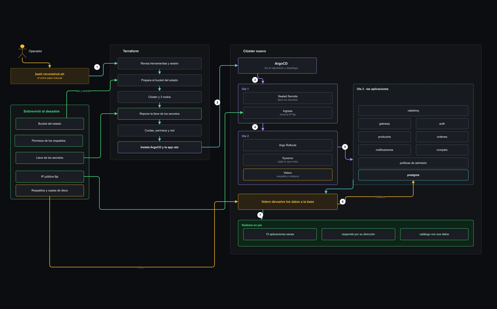
___
# Tabla de enlaces

Todo lo que hay que revisar de esta práctica está acá. 

| Qué | Dónde |
|---|---|
| Repositorio GitOps | https://github.com/Joe1172003/sa-p8-gitops |
| Aplicación raíz en ArgoCD | `raiz`, en el namespace `argocd` |
| Comando que reconstruye todo | [P9/bootstrap/reconstruir.sh](bootstrap/reconstruir.sh) |
| Dónde vive el registro de Terraform | Bucket de Google Cloud Storage `sa-p9-tfstate-202200271`, en us-central1, con bloqueo y versionado |
| Respaldos programados | Calendario `velero-cada-3-horas`, guarda en el bucket `sa-p9-velero-202200271` |
| Reconstrucción cronometrada | [evidencias/22-simulacro-linea-de-tiempo.txt](evidencias/22-simulacro-linea-de-tiempo.txt) |
| Restauración de datos verificada | [evidencias/14-restauracion-datos.txt](evidencias/14-restauracion-datos.txt) |
| Prueba de pérdida de nodo | [evidencias/17-perdida-nodo-corregido.txt](evidencias/17-perdida-nodo-corregido.txt) |
| Objetivos y resultados | RTO: 45 min declarado, **27 min medido**. RPO: 3 h declarado, **30 min medidos** ([declaración](evidencias/assets/objetivos-rto-rpo.md)) |
| Video | https://drive.google.com/file/d/1AkpxN67cj_EtV37xP_onc9IWxBBTxEYq/view?usp=sharing |

## Qué hay en cada carpeta

| Carpeta | Contenido |
|---|---|
| [bootstrap](bootstrap/) | El comando que reconstruye todo y dos ayudantes: preparar el bucket del registro y respaldar la llave de los secretos |
| [terraform/permanente](terraform/permanente/) | Lo que sobrevive a un desastre: respaldos, IP fija, permisos y la copia de la llave |
| [terraform/cluster](terraform/cluster/) | Lo que se destruye y se vuelve a crear: clúster, nodos, ArgoCD |
| [pruebas](pruebas/) | Los dos scripts de prueba: restauración de datos y pérdida de nodo |
| [evidencias](evidencias/) | Salidas de comandos con hora y resultado |
| [evidencias/assets](evidencias/assets/) | Capturas, diagrama y objetivos declarados |

## Las pruebas y sus resultados

| Prueba | Resultado | Evidencia |
|---|---|---|
| Reconstrucción desde cero | 27 minutos| [22](evidencias/22-simulacro-linea-de-tiempo.txt) |
| Restauración de datos | Volvieron los 4 productos, 24 usuarios y 5 órdenes | [14](evidencias/14-restauracion-datos.txt) |
| Pérdida de nodo, sin la base | 83 peticiones, 0 fallas | [18](evidencias/18-perdida-nodo-sin-base.txt) |
| Pérdida de nodo, con la base | El gateway responde 100%, el catálogo se corta 1 min 11 s | [17](evidencias/17-perdida-nodo-corregido.txt) |
| Los secretos siguen abriéndose | Los 8 se descifraron con la llave respaldada | [10](evidencias/10-continuidad-secretos.txt) |
| Respaldos automáticos | Cada 3 horas, se guardan 3 días | [15](evidencias/15-respaldos-velero.txt) |

# Evidencias

## Lo que sobrevive al desastre

El registro de Terraform vive en la nube, no en mi máquina, y guarda versiones anteriores por si un cambio sale mal.

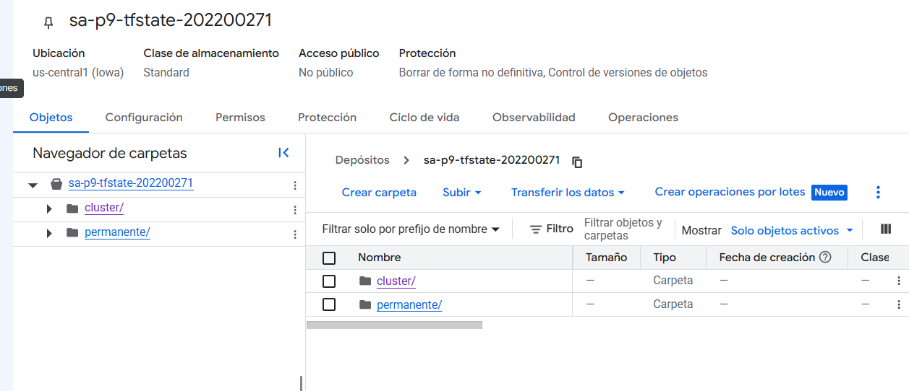

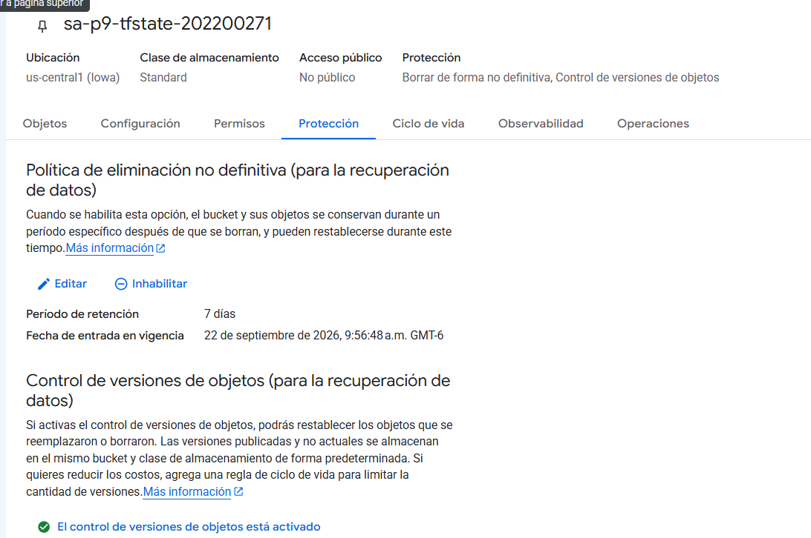

La dirección pública queda reservada aparte del clúster. Por eso el sistema
vuelve con la misma dirección después de reconstruirlo.

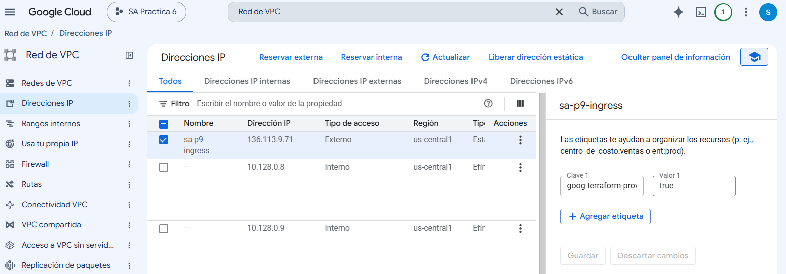

La llave que abre los secretos, guardada fuera del clúster. Sin esto, el
repositorio quedaría lleno de contenido que nadie puede leer.

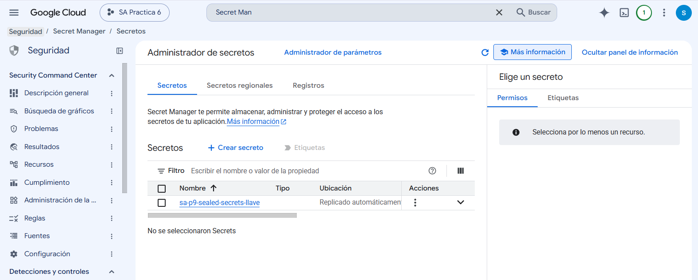

Los permisos de la cuenta que respalda, recortados a lo mínimo.

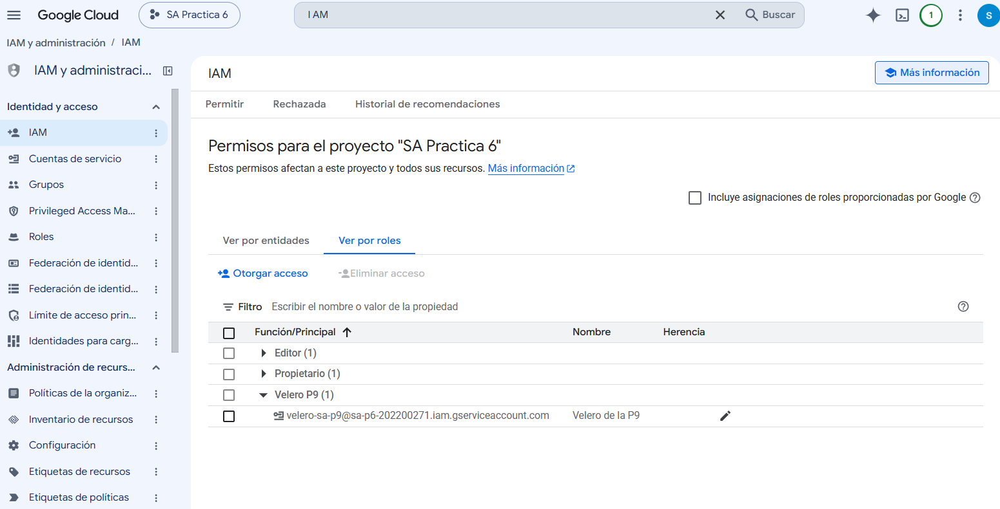

## El clúster

Creado por código, con tres nodos.

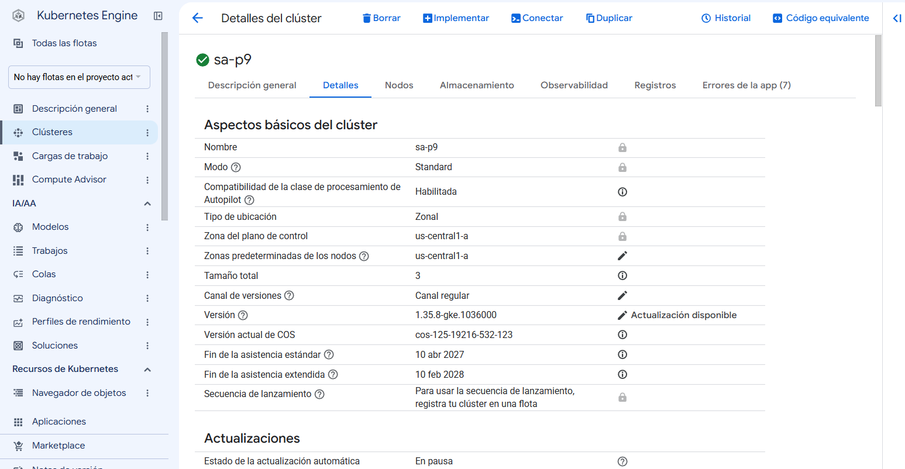

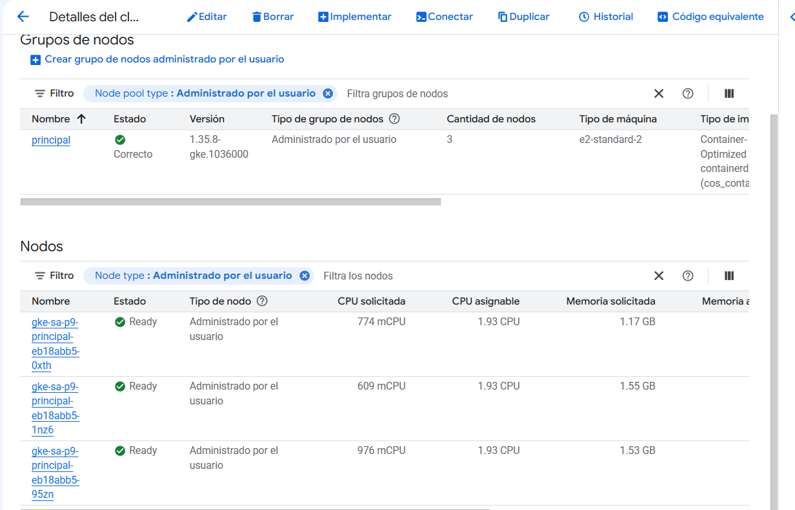

## Respaldos

El bucket donde vive todo lo respaldado, fuera del clúster que respalda.

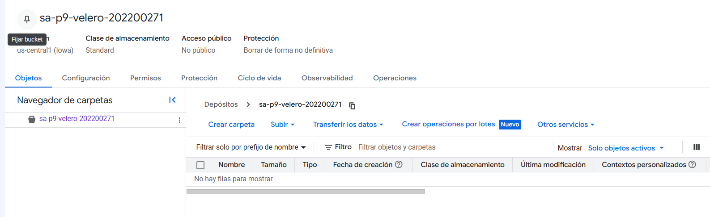

Un respaldo por dentro: los archivos del sistema y, sobre todo, las copias de los
discos.

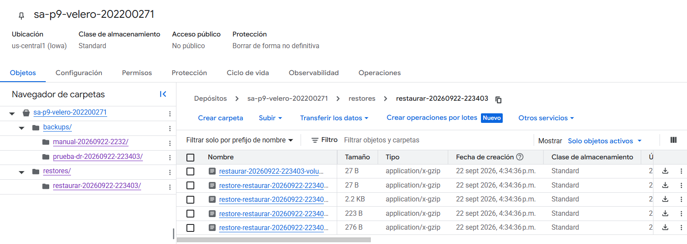

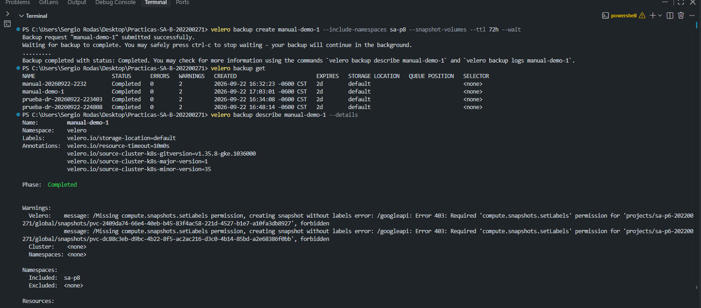

## Pérdida de un nodo

Cada servicio con sus copias repartidas en nodos distintos. Si cae uno, siempre
queda otra viva.

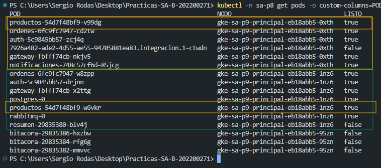

Vaciando un nodo a propósito, con el sistema atendiendo.

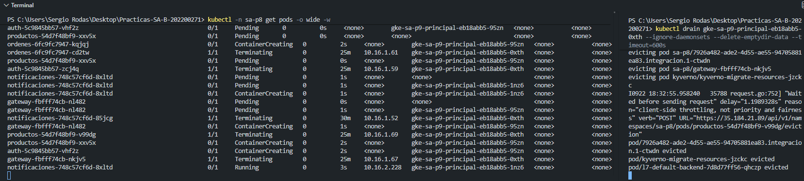

El tráfico durante ese rato: 83 peticiones, ninguna falló.

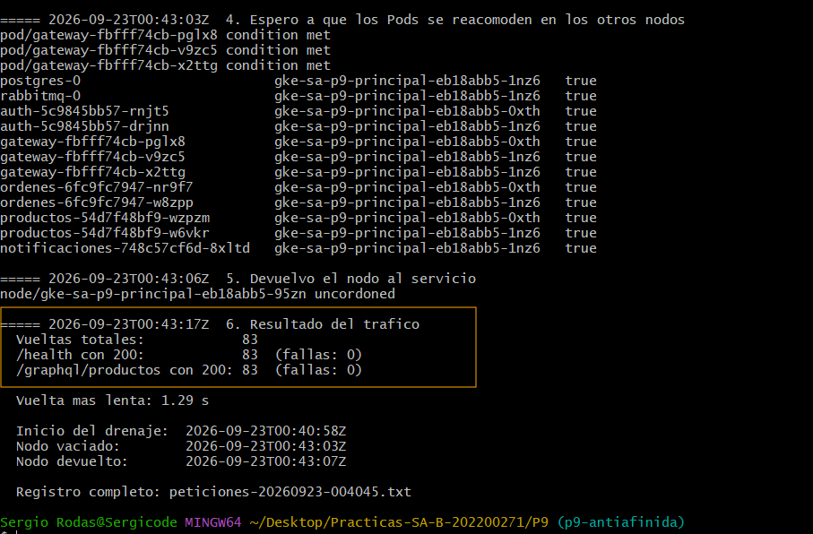
___


# Runbook de recuperación

Esto es lo que hay que hacer si el clúster desaparece. Lo escribí para que lo
pueda ejecutar alguien que nunca vio este sistema.

El resumen es corto: **hay un solo comando que reconstruye todo**. Los pasos de
abajo son para llegar hasta ese comando y para comprobar que quedó bien.

Tiempo estimado: **30 minutos**, de los cuales 25 son esperar.

## Antes de empezar

Necesitás dos cosas.

**Acceso al proyecto de Google Cloud** `sa-p6-202200271`, con permiso de editor.

**Cinco programas instalados:** `gcloud`, `terraform`, `kubectl`, `helm` y `velero`.
Si no querés instalar nada, abrí **Cloud Shell** desde la consola de Google: trae
los primeros cuatro y solo hay que agregarle velero.

```bash
curl -sSL -o velero.tar.gz https://github.com/vmware-tanzu/velero/releases/download/v1.18.2/velero-v1.18.2-linux-amd64.tar.gz
tar -xzf velero.tar.gz && sudo mv velero-v1.18.2-linux-amd64/velero /usr/local/bin/
```

Trabajar desde Cloud Shell es lo que recomiendo: cuando hice el simulacro se me
cayó internet a mitad de la reconstrucción y tuve que destrabar el estado a mano.

## Paso 1: conseguir el código

```bash
git clone https://github.com/Joe1172003/Practicas-SA-B-202200271.git
cd Practicas-SA-B-202200271/P9
```

## Paso 2: identificarse en Google Cloud

```bash
gcloud auth login
gcloud auth application-default login
gcloud config set project sa-p6-202200271
```

El segundo comando es el que usa Terraform. Si lo saltas, el paso 4 falla con un
error de credenciales.

Comprobalo así:
```bash
gcloud auth application-default print-access-token
```
Si imprime un texto largo, estás listo.

## Paso 3: reconstruir

```bash
bash bootstrap/reconstruir.sh
```

Eso es todo. El script hace nueve cosas en orden y va imprimiendo la hora de cada
una:

1. Revisa que tengas las herramientas y la sesión.
2. Crea el bucket donde Terraform guarda su registro, si no existe.
3. Levanta lo que sobrevive a un desastre: el bucket de respaldos, la IP pública y
   la copia de la llave de los secretos.
4. Crea el clúster, los 3 nodos y ArgoCD. Es el paso largo, unos 14 minutos.
5. Conecta `kubectl` al clúster nuevo.
6. Espera a que ArgoCD despliegue las 15 aplicaciones. Unos 9 minutos.
7. Busca el último respaldo de Velero y devuelve los datos a la base.
8. Prueba que el sistema responda.
9. Imprime los tiempos.

Mientras corre no hace falta tocar nada. Si te preocupa que se haya colgado,
mirá el contador de `Still creating...`: GKE tarda entre 10 y 12 minutos en
entregar los nodos y no hay forma de apurarlo.

Para dejar la base vacía en lugar de restaurar los datos:
```bash
bash bootstrap/reconstruir.sh --sin-datos
```

## Paso 4: comprobar que quedó bien

Los comandos de abajo son para una terminal de Linux, Cloud Shell o Git Bash. Si
estás en PowerShell de Windows, escribí `curl.exe` en lugar de `curl`: ahí `curl`
es otro programa y rechaza estas opciones.

Tres revisiones. Si las tres pasan, se restauro correctamente.

**Las aplicaciones:**
```bash
kubectl -n argocd get app
```
Tienen que ser 15, todas en `Synced` y `Healthy`.

**El sistema desde afuera.** La dirección `136.113.9.71.nip.io` apunta sola a la
IP del sistema, sin configurar nada.
```bash
curl http://136.113.9.71.nip.io/health
```
Responde `{"estado":"ok","servicio":"api-gateway","version":"2.2.1"}`.

**Los datos:**
```bash
curl -X POST -H "Content-Type: application/json" \
  -d '{"query":"{ productos { nombre precio } }"}' \
  http://136.113.9.71.nip.io/graphql/productos
```
Devuelve el catálogo con sus productos y precios. Si contesta una lista vacía, la
restauración no trajo los datos: mirá el paso 7 del script.

En PowerShell de Windows, `curl` es otro programa y rechaza esas opciones. Usá
estos dos en su lugar:
```powershell
curl.exe http://136.113.9.71.nip.io/health

Invoke-RestMethod -Uri "http://136.113.9.71.nip.io/graphql/productos" -Method Post -ContentType "application/json" -Body '{"query":"{ productos { nombre precio } }"}' | ConvertTo-Json -Depth 5
```

## Si algo sale mal

Estos cuatro problemas me pasaron de verdad durante el simulacro. Los dejo con su
solución para que nadie los tenga que averiguar de nuevo.

**El clúster no se deja destruir y el mensaje dice `context deadline exceeded`.**
Las aplicaciones de ArgoCD piden que alguien las limpie antes de borrarse, pero
ArgoCD ya no existe. Quitales esa condición:
```bash
kubectl -n argocd get applications -o name | while read a; do
  kubectl -n argocd patch "$a" --type merge -p '{"metadata":{"finalizers":null}}'
done
```

**Terraform dice `Error acquiring the state lock`.**
Alguien quedó a mitad de camino, casi siempre por una caída de red. El propio
mensaje trae el número en la línea `ID:`. Con eso:
```bash
cd terraform/cluster
terraform force-unlock EL_NUMERO_DEL_MENSAJE
```
Usalo solo si estás seguro de que nadie más está aplicando cambios.

**Terraform dice `Error 409: Already exists`.**
Quedaron recursos creados en Google que Terraform no alcanzó a registrar. Lo más
simple es borrarlos y volver a empezar:
```bash
gcloud container clusters delete sa-p9 --zone us-central1-a --quiet
gcloud iam service-accounts delete nodos-sa-p9@sa-p6-202200271.iam.gserviceaccount.com --quiet
```
Después repetí el paso 3.

**La restauración queda en `PartiallyFailed`.**
Casi siempre es porque la copia del disco todavía se está subiendo a Google. El
script reintenta solo una vez; si vuelve a fallar, esperá un par de minutos,
revisá que todas digan `READY` y volvé a correrlo:
```bash
gcloud compute snapshots list
```

## Para mirar por dentro

La consola de ArgoCD se abre así:
```bash
kubectl -n argocd port-forward svc/argocd-server 8080:80
```
Entrás en `http://localhost:8080` con el usuario `admin`. La contraseña cambia en
cada reconstrucción y se consulta con esto en gitbash o cloud shell de gcp:
```bash
kubectl -n argocd get secret argocd-initial-admin-secret -o jsonpath="{.data.password}" | base64 -d
```

Los respaldos disponibles:
```bash
velero backup get
```


# Informe de la prueba de DR

Destruí el clúster completo el 23/09/2026 y lo reconstruí con el cronómetro
corriendo. Las horas están en UTC y salen del registro del script, no de mi
memoria. El detalle completo está en
[evidencias/22-simulacro-linea-de-tiempo.txt](evidencias/22-simulacro-linea-de-tiempo.txt).

## Objetivos declarados

Los escribí y los subí al repositorio antes de tocar nada, en
[objetivos-rto-rpo.md](evidencias/assets/objetivos-rto-rpo.md). Ese orden me
importaba: medir primero y declarar después convierte el objetivo en una excusa.

| Objetivo | Valor | Por qué ese número |
|---|---|---|
| RTO | 45 minutos | Sumé lo que ya había medido por partes en las fases anteriores (unos 27 minutos) y le dejé margen para que algo se portara distinto el día del simulacro |
| RPO | 3 horas | Es la frecuencia del respaldo automático. El sistema recibe pocas escrituras al día y no mueve dinero, así que perder hasta 3 horas es asumible solo para este ecenario |

## Escenario ejecutado

Borré todo lo que vive dentro del clúster y dejé en pie lo que, por diseño, tiene
que sobrevivir a un incendio.

1. **01:48** Respaldo a pedido con Velero: 541 objetos y los discos de las dos
   bases.
2. **01:55** Escribí un producto a propósito, después del respaldo, para poder
   medir la pérdida real.
3. **02:05** Arranqué la destrucción con Terraform, en la capa del clúster.
4. **02:18** Quedó borrado todo: los 3 nodos, las 15 aplicaciones, ArgoCD y los
   discos de postgres y rabbitmq.

Sobrevivieron, como estaba previsto, la IP pública, el bucket con los respaldos,
las copias de los discos y la llave que descifra los secretos.

## Tiempos medidos

**RTO real: 27 minutos con 1 segundo.**

| Momento | Hora | Duración |
|---|---|---|
| Arranca la reconstrucción | 03:02:52 | |
| Clúster, nodos y ArgoCD listos | 03:17:27 | 14 min 35 s |
| Las 15 aplicaciones sanas | 03:26:32 | 9 min 5 s |
| Datos restaurados y sistema probado | 03:29:53 | 3 min 21 s |

Todo lo hizo un solo comando, `bootstrap/reconstruir.sh`, sin pasos manuales.

Hay algo que no cuento en esos 27 minutos y que igual dejo escrito: antes hubo un
intento fallido. Se me cayó internet a mitad de la reconstrucción y entre
destrabar el estado y limpiar lo que quedó a medias pasaron 43 minutos más. La
causa fue mi conexión, no el sistema, pero en una emergencia de verdad esos
minutos los habrían sufrido los usuarios igual.

## Pérdida medida

**RPO real: 30 minutos de ventana, un producto perdido.**

Se perdió todo lo escrito entre el respaldo de las 01:48 y la destrucción de las
02:18. En la práctica, en esa media hora solo se escribió un dato: el producto
"PERDIDO EN EL SIMULACRO", que puse ahí justamente para esto. Después de
restaurar, el catálogo volvió con los otros cuatro productos, sus precios, los 24
usuarios y las 5 órdenes, y ese producto ya no estaba.

No se perdió nada más porque los datos viven en un solo lugar, la base, y esa base
sí estaba respaldada.

## Puntos únicos de fallo detectados

Cuatro cosas que ningún manifiesto muestra y que solo aparecen cuando destruís de
verdad.

1. **La destrucción se traba sola.** Las aplicaciones de ArgoCD piden que alguien
   las limpie antes de borrarse, pero para entonces ArgoCD ya no existe. Terraform
   esperó a alguien que nunca iba a llegar y cortó con un error de tiempo agotado.

2. **Todo depende de la máquina del operador.** Cuando se cayó mi internet,
   Terraform había creado el clúster en Google pero no alcanzó a anotarlo en su
   registro. Quedaron desincronizados, y encima el registro quedó bloqueado por un
   proceso que ya estaba muerto.

3. **Faltaba un permiso, y solo para restaurar.** A la cuenta de Velero le faltaba
   poder etiquetar discos. Respaldar funcionaba desde el primer día; el camino de
   vuelta, no. Nadie lo iba a notar hasta el día del desastre real.

## Brecha y plan

Cumplí el objetivo: 27 minutos contra 45 declarados. Igual la prueba dejó cuatro
cosas por hacer, y las ordeno por lo que más duele.

| Qué encontré | Qué voy a hacer |
|---|---|
| Depende de mi máquina y mi internet | Ejecutar la reconstrucción desde Cloud Shell, que corre en la nube de Google. Ya lo dejé escrito en el runbook |
| La destrucción se traba | Agregar al procedimiento un paso previo que libere las aplicaciones antes de borrar, para no improvisarlo con el sistema caído |
| Un permiso faltante que nadie vio en un mes | Repetir este simulacro cada cierto tiempo. Un respaldo que nunca se restauró es una promesa, no un respaldo. Ya corregí el permiso |
| La base sin réplica | Pasar postgres a primario con réplica y cambio automático. Es el trabajo más grande de los cuatro y hoy queda como deuda declarada |

Si tuviera que ajustar el objetivo con lo que sé ahora, dejaría el RTO en 45
minutos igual. Los 27 salieron de una corrida sin sorpresas, y el intento fallido
mostró que una sorpresa chica cuesta más que el margen entero.


